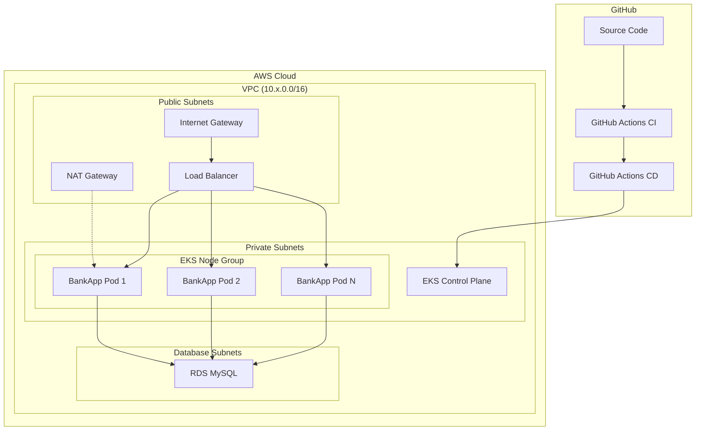

# BankApp Cloud Migration Demo Walkthrough

## Overview

This walkthrough demonstrates how Devin migrated the Spring Boot BankApp from a local Docker Compose setup with a Jenkins CI pipeline to a fully cloud-native deployment on **AWS EKS** with **Terraform** infrastructure-as-code and **GitHub Actions** CI/CD.

---

## Before: Local-Only Setup

The application originally ran as a local stack:

- **Runtime**: Docker Compose with two containers (Spring Boot app + MySQL)
- **CI**: Jenkins pipeline with shared library (Trivy, OWASP, SonarQube scanning)
- **CD**: Jenkins GitOps job updating Kubernetes manifests manually
- **Infrastructure**: Manual EKS cluster provisioned via `eksctl` CLI commands
- **State**: No infrastructure versioning or reproducibility

```
┌─────────────────────────────────────────────┐
│              Developer Machine               │
│                                              │
│  ┌──────────┐     ┌──────────┐              │
│  │ BankApp  │────▶│  MySQL   │              │
│  │ :8080    │     │  :3306   │              │
│  └──────────┘     └──────────┘              │
│       docker-compose up                      │
└─────────────────────────────────────────────┘
         │
         ▼
┌─────────────────┐     ┌──────────────────┐
│  Jenkins CI     │────▶│  Jenkins CD      │
│  (Build/Scan)   │     │  (GitOps update) │
└─────────────────┘     └──────────────────┘
         │
         ▼
   Manual eksctl
   cluster setup
```

---

## After: Cloud-Native Architecture



---

## What Devin Created

### 1. Terraform Infrastructure (`terraform/`)

| File | Purpose |
|------|---------|
| `main.tf` | AWS provider, S3 backend for state management, DynamoDB lock table |
| `variables.tf` | Parameterized inputs (region, instance types, scaling config) |
| `vpc.tf` | VPC with 3 AZs, public/private/database subnets, NAT gateway |
| `eks.tf` | EKS cluster with managed node group, IAM roles and policies |
| `rds.tf` | RDS MySQL 8.0 with encryption, automated backups, multi-AZ (prod) |
| `security.tf` | Security groups: EKS cluster, worker nodes, RDS (least-privilege) |
| `outputs.tf` | Cluster endpoint, RDS endpoint, VPC and subnet IDs |

#### Environment Configurations (`terraform/environments/`)

| Environment | Nodes | Instance Type | DB Class | Multi-AZ |
|-------------|-------|---------------|----------|----------|
| `dev` | 1-3 (desired: 2) | t3.medium | db.t3.micro | No |
| `staging` | 2-4 (desired: 2) | t3.medium | db.t3.small | No |
| `prod` | 2-6 (desired: 3) | t3.large | db.r6g.large | Yes |

### 2. GitHub Actions CI/CD (`.github/workflows/`)

| Workflow | Trigger | What It Does |
|----------|---------|--------------|
| `ci.yml` | Push/PR to DevOps | Build Maven project, run tests with MySQL service, build & push Docker image to GHCR, validate Terraform |
| `cd.yml` | After CI success or manual dispatch | Apply Terraform infrastructure, deploy K8s manifests to EKS, verify rollout |

---

## Architecture Decisions

### Why EKS over ECS?
The application already had Kubernetes manifests (deployments, services, ingress, HPA). EKS preserves this investment and provides a natural migration path.

### Why RDS over MySQL in Kubernetes?
Running MySQL in Kubernetes requires managing PersistentVolumes, backups, and failover manually. RDS provides automated backups, encryption at rest, multi-AZ failover, and managed patching.

### Why GitHub Actions over Jenkins?
GitHub Actions is tightly integrated with the repository, requires no separate infrastructure, and provides a modern workflow syntax with marketplace actions for AWS and Kubernetes.

### Terraform State Management
State is stored in S3 with DynamoDB locking to enable team collaboration and prevent concurrent modifications.

---

## How to Run the Demo

### Prerequisites

```bash
# Install required tools
brew install terraform awscli kubectl

# Configure AWS credentials
aws configure
```

### Step 1: Create the Terraform State Backend

```bash
# One-time setup: Create S3 bucket and DynamoDB table for state
aws s3api create-bucket \
  --bucket bankapp-terraform-state \
  --region us-east-1

aws dynamodb create-table \
  --table-name bankapp-terraform-locks \
  --attribute-definitions AttributeName=LockID,AttributeType=S \
  --key-schema AttributeName=LockID,KeyType=HASH \
  --billing-mode PAY_PER_REQUEST
```

### Step 2: Deploy Infrastructure with Terraform

```bash
cd terraform

# Initialize Terraform
terraform init

# Preview changes for dev environment
terraform plan -var-file="environments/dev.tfvars" \
  -var="db_password=YourSecurePassword123!" \
  -var="db_username=bankapp_admin"

# Apply infrastructure
terraform apply -var-file="environments/dev.tfvars" \
  -var="db_password=YourSecurePassword123!" \
  -var="db_username=bankapp_admin"
```

### Step 3: Configure kubectl

```bash
aws eks update-kubeconfig \
  --name bankapp-dev-eks \
  --region us-east-1
```

### Step 4: Deploy Application

```bash
# Apply Kubernetes manifests
kubectl apply -f kubernetes/bankapp-namespace.yaml
kubectl apply -f kubernetes/configmap.yaml
kubectl apply -f kubernetes/secrets.yaml
kubectl apply -f kubernetes/mysql-deployment.yml
kubectl apply -f kubernetes/mysql-service.yaml
kubectl apply -f kubernetes/bankapp-deployment.yml
kubectl apply -f kubernetes/bankapp-service.yaml
kubectl apply -f kubernetes/bankapp-ingress.yml
kubectl apply -f kubernetes/bankapp-hpa.yml

# Verify deployment
kubectl get all -n bankapp-namespace
```

### Step 5: CI/CD Pipeline (Automated)

Once GitHub Secrets are configured, the pipeline runs automatically:

| Secret | Description |
|--------|-------------|
| `AWS_ROLE_ARN` | IAM role ARN for OIDC federation |
| `DB_USERNAME` | RDS master username |
| `DB_PASSWORD` | RDS master password |

Push to `DevOps` branch triggers: **Build → Test → Docker Build → Terraform Apply → K8s Deploy**

### Step 6: Tear Down

```bash
cd terraform
terraform destroy -var-file="environments/dev.tfvars" \
  -var="db_password=x" \
  -var="db_username=x"
```

---

## File Summary

```
New files added (13 total):
├── terraform/
│   ├── main.tf                        # Provider + S3 backend
│   ├── variables.tf                   # Input variables
│   ├── vpc.tf                         # VPC, subnets, NAT, routing
│   ├── eks.tf                         # EKS cluster + node group
│   ├── rds.tf                         # RDS MySQL instance
│   ├── security.tf                    # Security groups
│   ├── outputs.tf                     # Terraform outputs
│   └── environments/
│       ├── dev.tfvars                 # Dev environment config
│       ├── staging.tfvars             # Staging environment config
│       └── prod.tfvars                # Prod environment config
├── .github/workflows/
│   ├── ci.yml                         # CI: build, test, Docker, TF validate
│   └── cd.yml                         # CD: infrastructure + app deployment
└── DEMO_WALKTHROUGH.md                # This file
```
