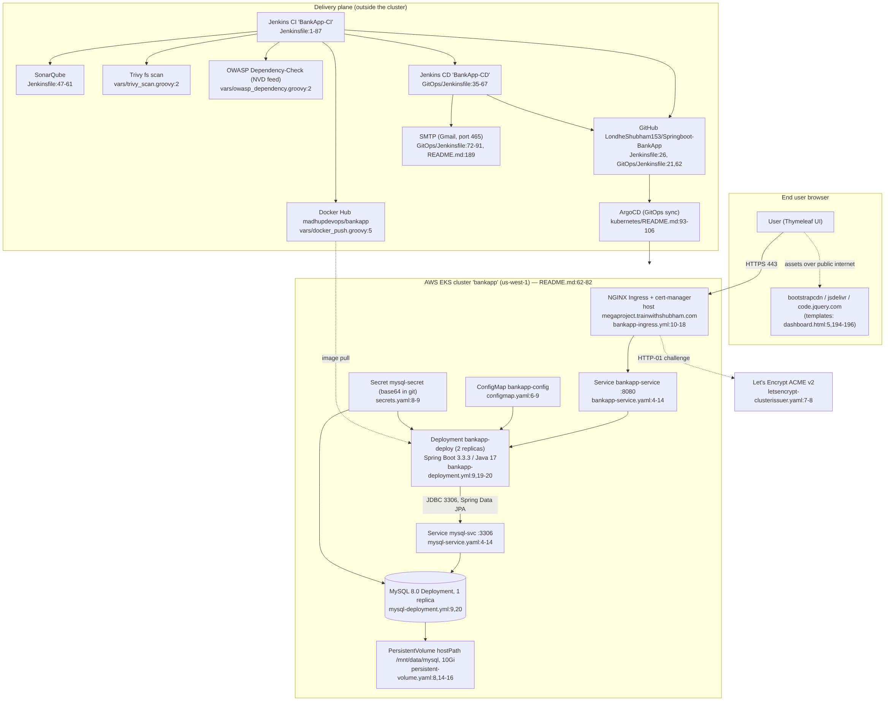
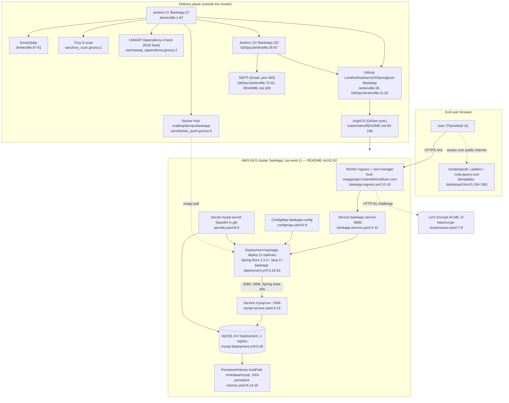
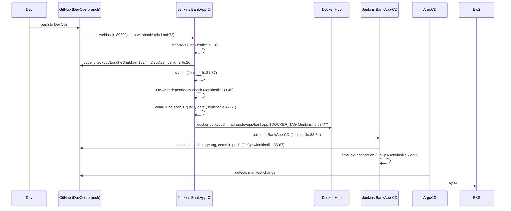
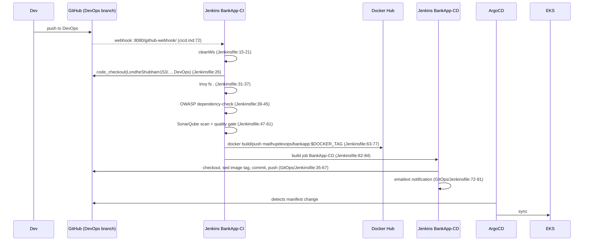

# Current-State Architecture — Springboot-BankApp

Evidence base: commit `305826d`, branch `DevOps`. Every claim below cites `file:line` from this
repository. Statements that are **not** directly readable from the repo are prefixed with
**[INFERENCE]** and must be confirmed via `open-questions.md`.

No application code was changed in producing this document.

---

## 1. System context (as coded)

Diagram source

---

## 2. Runtimes and frameworks

| Component | Version (evidence) | Support status |
|---|---|---|
| Spring Boot | `3.3.3` — `pom.xml:8` | OSS support for the 3.3.x line ended 2025-06-30; commercial support only. **Upgrade required.** |
| Java | `java.version=17` — `pom.xml:30` | Java 17 LTS, supported. |
| Maven compiler plugin | `3.8.0`, `source`/`target` = **`1.8`** — `pom.xml:78-86` | **Conflict**: the plugin config pins bytecode to Java 8 while the Boot parent expects 17. Boot's parent property normally wins via `maven.compiler.release`, but the explicit `source`/`target` here override it. Build hygiene defect to resolve before containerising for Fargate. |
| MySQL JDBC driver | `mysql:mysql-connector-java:8.0.33` — `pom.xml:54-59` | Legacy GA coordinates, superseded by `com.mysql:mysql-connector-j`. Will not carry to Postgres. |
| Servlet container | Embedded Tomcat (default of `spring-boot-starter-web`, `pom.xml:45-48`), port 8080 — `Dockerfile:34` | Supported. |
| View layer | Thymeleaf + `thymeleaf-extras-springsecurity6` — `pom.xml:41-52`; 4 templates, 593 lines total (`src/main/resources/templates/*.html`) | Server-rendered; no SPA, no REST API surface. |
| Build image | `maven:3.8.3-openjdk-17` → runtime `openjdk:17-alpine` — `Dockerfile:6,28` | `openjdk:*` Docker Hub images are **deprecated / no longer updated**. Base image must change. |
| Maven wrapper | Maven `3.9.7` — `.mvn/wrapper/maven-wrapper.properties:19` | Supported. |
| MySQL engine | `mysql:8.0` in K8s (`mysql-deployment.yml:20`); `mysql:latest` in Compose (`docker-compose.yml:4`) and Helm (`helm/bankapp/values.yaml:27`) | Version drift between environments; `latest` is unpinned. |

**Health endpoints do not exist.** `spring-boot-starter-actuator` is absent from `pom.xml`, yet
`/actuator/health` is used as the container health check in `docker-compose.yml:36` and as both
liveness and readiness probes in `helm/bankapp/templates/deployment.yml:43-54`. Those probes will
return 404/401 and fail. The raw K8s deployment sidesteps this only because both probes are
commented out (`kubernetes/bankapp-deployment.yml:44-55`). Observability and ALB/ECS health checks
must be addressed as part of the migration, not assumed.

---

## 3. Datastores and data access

### Engines

| Datastore | Engine + version | How provisioned | Evidence |
|---|---|---|---|
| `BankDB` (K8s / Compose) | MySQL 8.0 (K8s), `mysql:latest` (Compose, Helm) | Single-replica in-cluster `Deployment`; Helm variant uses a 1-replica `StatefulSet` | `mysql-deployment.yml:9,20`; `docker-compose.yml:4,8`; `helm/bankapp/templates/mysqlStatefulSet.yml:10,21` |
| `bankappdb` (developer default) | MySQL, unspecified version | Local `localhost:3306` | `src/main/resources/application.properties:3` |
| — | No cache, no search index, no object store, no secondary datastore anywhere in the repo | | (absence across `src/`, `kubernetes/`, `helm/`) |

Two different database names are in play — `bankappdb` in the packaged
`application.properties:3` and `BankDB` in every deployed environment
(`configmap.yaml:7-8`, `docker-compose.yml:8`, `helm/bankapp/values.yaml:8`). Deployments only work
because `SPRING_DATASOURCE_URL` is injected as an env var and overrides the property
(`kubernetes/bankapp-deployment.yml:24-28`).

### Access pattern — counts

The application talks to MySQL **exclusively through Spring Data JPA / Hibernate**. Full inventory:

| Access mechanism | Count | Locations |
|---|---|---|
| JPA entities | 2 | `model/Account.java:11-12`, `model/Transaction.java:7-8` |
| Spring Data repositories | 2 | `repository/AccountRepository.java:8`, `repository/TransactionRepository.java:8` |
| Derived query methods | 2 | `AccountRepository.java:9` (`findByUsername`), `TransactionRepository.java:9` (`findByAccountId`) |
| `@Query` / JPQL / native queries | **0** | — |
| `JdbcTemplate` / `EntityManager` / raw JDBC | **0** | — |
| Stored procedure calls | **0** | — |
| Persistence call sites in service layer | 8 `save`/`find` calls | `service/AccountService.java:35,39,47,53,61,69,77,113,117,126,133` |
| SQL scripts in repo | 1 line, DDL only | `src/main/resources/static/mysql/SQLScript.txt:1` (`CREATE DATABASE bankappdb;`) |

**Schema is created and mutated at runtime by Hibernate**: `spring.jpa.hibernate.ddl-auto=update`
(`application.properties:9`). There is no Flyway/Liquibase dependency in `pom.xml`. There is
therefore **no versioned schema artefact** to migrate — the target schema must be derived from the
entity classes or extracted from a live database.

Dialect is pinned to `org.hibernate.dialect.MySQL8Dialect` (`application.properties:10`) and SQL
logging is on in all environments (`application.properties:11`) — the latter writes every statement,
including account identifiers, to stdout.

### Transactional behaviour

`AccountService` carries **no `@Transactional` annotation anywhere** (verified: zero occurrences in
`src/`). `transferAmount` performs four independent repository writes — debit
(`AccountService.java:112-113`), credit (`:116-117`), and two transaction rows (`:126`, `:133`) —
each in its own auto-commit transaction. A failure between them leaves the ledger inconsistent. This
is a correctness property that the target platform inherits; retries or multi-AZ failover will make
partial-transfer windows **more** likely, not less.

### Data volume

Unknown from the repo. Storage requests are the only proxy: 10Gi in
`persistent-volume-claim.yaml:11` and 5Gi in `helm/bankapp/values.yaml:14`. **[INFERENCE]** these
are arbitrary defaults, not capacity planning. See `open-questions.md`.

---

## 4. Outbound integrations

| # | Integration | Direction / protocol | Who calls it | Evidence |
|---|---|---|---|---|
| 1 | MySQL | JDBC/TCP 3306, `useSSL=false` | Application | `configmap.yaml:8`, `application.properties:3`, `docker-compose.yml:25` |
| 2 | bootstrapcdn.com | HTTPS, browser-side | Rendered pages | `login.html:5`, `register.html:5`, `dashboard.html:5,196`, `transactions.html:5` |
| 3 | code.jquery.com | HTTPS, browser-side | Rendered pages | `dashboard.html:194` |
| 4 | cdn.jsdelivr.net (popper) | HTTPS, browser-side | Rendered pages | `dashboard.html:195` |
| 5 | Let's Encrypt ACME v2 | HTTPS outbound + inbound HTTP-01 | cert-manager | `letsencrypt-clusterissuer.yaml:7-8,11-14` |
| 6 | Docker Hub | HTTPS push (CI) and pull (cluster) | Jenkins / kubelet | `vars/docker_push.groovy:3-5`, `bankapp-deployment.yml:20`, `helm/bankapp/values.yaml:26` |
| 7 | GitHub `LondheShubham153/Springboot-BankApp` | HTTPS clone + push | Jenkins CI and CD | `Jenkinsfile:26`, `GitOps/Jenkinsfile:21,62` |
| 8 | SonarQube server (Jenkins tool `Sonar`) | HTTPS + webhook callback | Jenkins | `Jenkinsfile:6,50,58`, `vars/sonarqube_analysis.groovy:2-4` |
| 9 | NVD vulnerability feed | HTTPS (OWASP Dependency-Check) | Jenkins | `vars/owasp_dependency.groovy:2` |
| 10 | Trivy vulnerability DB | HTTPS | Jenkins | `vars/trivy_scan.groovy:2` |
| 11 | SMTP / Gmail, port 465 (SMTPS) | Outbound mail from Jenkins CD | Jenkins `emailext` | `GitOps/Jenkinsfile:72-91`, `README.md:189-212` |
| 12 | ArgoCD → EKS API | HTTPS | ArgoCD | `kubernetes/README.md:93-106` |
| 13 | Prometheus / Grafana (`kube-prometheus-stack`) | In-cluster scrape | Helm-installed | `README.md:308,332` |

Explicitly **absent** from the application: no `RestTemplate`, no `WebClient`, no message queue
client, no FTP/SFTP client, no file-share mount, no SMTP from the app itself, no scheduled jobs
(zero `@Scheduled`), no batch entrypoint. Verified by search across `src/` and `pom.xml`.

The only mail path in the system is the Jenkins CD build notification (#11), and the only queue-like
coupling is Jenkins job chaining: CI triggers `BankApp-CD` on success (`Jenkinsfile:79-85`).

---

## 5. Hosting and deployment model

### Runtime topology today

* Target platform is **AWS EKS**, cluster `bankapp`, region **us-west-1**, 2 × `t2.medium` nodes,
  min 2 / max 2, created imperatively with `eksctl` — `README.md:62-82`. There is **no IaC in this
  repository**: no Terraform, CloudFormation, CDK, or Pulumi. Infrastructure exists only as
  copy-paste CLI commands in markdown.
* Application: `Deployment` `bankapp-deploy`, 2 replicas, requests 250m/512Mi, limits 500m/1Gi —
  `bankapp-deployment.yml:9,56-62`. HPA 1–5 replicas at 40% CPU — `bankapp-hpa.yml:11-19`.
  Note the HPA's `minReplicas: 1` contradicts the deployment's "keep replicas >= 2 for HA" comment
  (`bankapp-deployment.yml:9`) and will scale the app down to a single pod.
* Database: **runs inside the cluster** as a plain `Deployment` with 1 replica —
  `mysql-deployment.yml:9`. No managed service, no read replica, no backup job, no PodDisruption
  budget.
* Ingress: NGINX ingress class with cert-manager TLS for `megaproject.trainwithshubham.com` —
  `bankapp-ingress.yml:10-18`. `ssl-redirect: "true"` forces HTTPS at the edge; traffic from the
  ingress to the pod is plain HTTP on 8080.
* Alternative packaging also present and **divergent**: the Helm chart deploys MySQL as a
  `StatefulSet` (`helm/bankapp/templates/mysqlStatefulSet.yml:2`), exposes the app as a **NodePort**
  30080 (`helm/bankapp/templates/service.yml:9,16`), uses host `bankapp.local`
  (`helm/bankapp/templates/ingress.yml:10`), and ships a `VerticalPodAutoscaler` in `Auto` mode
  (`helm/bankapp/templates/vpa.yaml:12`) alongside a CPU HPA (`helm/bankapp/templates/hpa.yaml`) —
  VPA `Auto` and HPA on CPU targeting the same Deployment is an unsupported combination.
* A third path exists for single-host deployment: `docker-compose.yml` driven by
  `vars/deploy.groovy:18` (`docker compose up -d`), plus an nginx reverse-proxy recipe for
  `bank.joakim.online` on port 80 → `localhost:8080` (`nginx.md:30-31,52`).

### How a release reaches prod today

Diagram source

Four defects in this path are readable directly from the files and must be treated as facts, not
risks:

1. **The pipeline does not build this repository.** Both Jenkinsfiles check out
   `https://github.com/LondheShubham153/Springboot-BankApp.git` (`Jenkinsfile:26`,
   `GitOps/Jenkinsfile:21`), an upstream third-party repo, and the CD job pushes commits back to it
   (`GitOps/Jenkinsfile:62`). Build provenance is broken.
2. **The CD `sed` targets a filename that does not exist.** It edits
   `kubernetes/bankapp-deployment.yaml` (`GitOps/Jenkinsfile:40`); the file in the repo is
   `bankapp-deployment.yml`. The substitution is a silent no-op.
3. **Image coordinates do not match.** CI publishes `madhupdevops/bankapp`
   (`Jenkinsfile:66,74`); the deployment pulls `trainwithshubham/bankapp-eks:v2`
   (`bankapp-deployment.yml:20`); the Helm chart pulls
   `trainwithshubham/springboot-bankapp:latest` (`helm/bankapp/values.yaml:26`); Compose pulls
   `joakim077/springboot-application` (`.env:1-2`). Four different images for one application.
4. **The quality gate does not gate.** `waitForQualityGate abortPipeline: false`
   (`vars/sonarqube_code_quality.groovy:3`) — a failed SonarQube gate cannot stop a release. Trivy
   is run as `trivy fs .` with no `--exit-code` (`vars/trivy_scan.groovy:2`), so it cannot fail the
   build either. The only test in the repo is `contextLoads()`
   (`src/test/java/com/example/bankapp/BankappApplicationTests.java:9-11`), and the image build
   skips tests entirely (`Dockerfile:21`, `-DskipTests=true`).

There is **no rollback mechanism, no environment promotion (no dev/stage/prod split), no approval
gate, and no GitHub Actions workflow** anywhere in the repo.

---

## 6. Authentication, session, secrets, and configuration

### AuthN / AuthZ

* Spring Security form login; custom login page `/login`, success → `/dashboard` —
  `config/SecurityConfig.java:35-40`.
* `UserDetailsService` is `AccountService` itself, backed by the `Account` table —
  `AccountService.java:23,85-97`; wired at `SecurityConfig.java:55-58`.
* Passwords: BCrypt — `SecurityConfig.java:23-25`, applied at `AccountService.java:45`.
* Authorisation: **a single hardcoded authority `"USER"` for every account** —
  `AccountService.java:99-101`. No roles, no admin, no segregation of duties, no method-level
  security anywhere.
* `/register` is `permitAll()`; everything else requires authentication —
  `SecurityConfig.java:31-34`. Self-service account creation is open to the internet.
* **CSRF is disabled** — `SecurityConfig.java:30` — while all money-moving endpoints are
  `POST` form submissions (`BankController.java:50,58,82`; forms at `dashboard.html:144,160,176`).
* `frameOptions.sameOrigin()` — `SecurityConfig.java:48-50`.

### Session model

Default Spring Boot **in-memory HTTP session** on the embedded Tomcat instance. There is no
`spring-session` dependency in `pom.xml`, no Redis, no JDBC session store, and no sticky-session
annotation on the ingress (`bankapp-ingress.yml:6-10`). With `replicas: 2`
(`bankapp-deployment.yml:9`) and round-robin Service load balancing, **users are logged out
whenever a request lands on the other pod**. **[INFERENCE]** this is currently masked in demos by
low traffic or by scale-down to 1 pod via `bankapp-hpa.yml:11`.

### Where secrets and config live today

| Secret / config | Location | Evidence |
|---|---|---|
| DB username + password `Test@123` | **Committed in plaintext** in the packaged properties file | `application.properties:4-5` |
| DB root + app password | **Committed base64** (not encryption) in a K8s Secret manifest | `secrets.yaml:8-9` |
| DB root + app password | **Committed plaintext** in Helm values, base64-encoded at template time | `helm/bankapp/values.yaml:52-53`, `helm/bankapp/templates/secrets.yml:8-9` |
| DB password | **Committed plaintext** in Compose env | `docker-compose.yml:7,26` |
| Docker Hub user / image | `.env` committed to the repo | `.env:1-2` |
| Docker Hub credentials | Jenkins credential IDs `docker` / `dockerhub` | `vars/docker_push.groovy:2`, `vars/pushImage.groovy:2` |
| GitHub credentials | Jenkins credential ID `Github-cred` | `GitOps/Jenkinsfile:50` |
| Gmail app password (SMTP) | Jenkins global config, set by hand | `README.md:191-212` |
| Runtime DB config | K8s ConfigMap (URL, username, DB name) | `configmap.yaml:6-9` |
| TLS certificate | cert-manager-managed Secret `bankapp-tls-secret` | `bankapp-ingress.yml:16` |

There is **no AWS Secrets Manager, Parameter Store, Vault, or SOPS usage anywhere**, and no Spring
profile separation (`application-*.properties` does not exist) — a single properties file serves all
environments, with env-var overrides injected per deployment.

---

## 7. State on local disk

| Item | Path | Evidence | Notes |
|---|---|---|---|
| MySQL data files | `/var/lib/mysql`, mounted from **hostPath** `/mnt/data/mysql`, subPath `mysql-data` | `mysql-deployment.yml:34-41`, `persistent-volume.yaml:14-16` | Node-local. If the pod reschedules to the other node, it starts against an empty directory. This is the single largest data-loss risk in the current design. |
| MySQL data files (Helm path) | `volumeClaimTemplates` 5Gi + a `manual`-class hostPath PV at `/tmp/bankapp-mysql` | `helm/bankapp/templates/mysqlStatefulSet.yml:56-66`, `helm/bankapp/templates/persistentVolume.yml:14-16` | `/tmp` on the host — wiped on node restart. |
| MySQL data (Compose) | named volume `bankapp-volume` | `docker-compose.yml:9-10,45-46` | Single-host only. |
| Application state on disk | **None** | no file I/O in `src/` (zero `new File` / `FileOutputStream` / upload handlers) | The app itself is stateless apart from the HTTP session held in JVM memory (§6). |
| Static assets | packaged in the jar | `src/main/resources/static/images/wells-fargo-logo.png`, `Dockerfile:31` | Immutable. |
| Logs | stdout only; no file appender, no logback config | absence of `logback*.xml` in `src/main/resources` | Captured by the container runtime; **no audit log of financial events exists anywhere**. |

**Net stateful footprint to migrate: one MySQL database, plus in-JVM HTTP sessions.** Everything
else in the running system is disposable.
