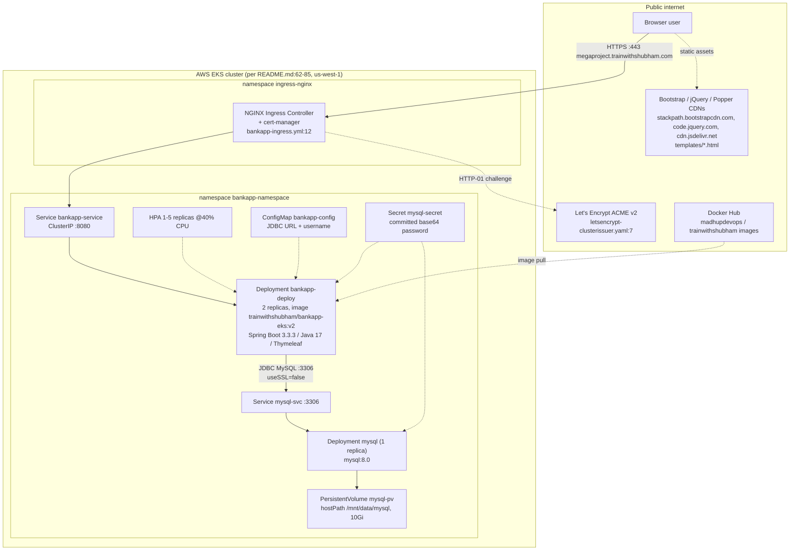

# Current State — COG-GTM/Springboot-BankApp

Scope: everything below is derived from the files on branch `DevOps` of this repository. Every
statement carries a `file:line` citation. Statements that were not read directly out of a file are
prefixed **Inference:**.

Mermaid source — current runtime context

Mermaid source — current release flow

```mermaid
graph LR
    dev["Developer commit<br/>COG-GTM/Springboot-BankApp<br/>branch DevOps"]
    ci["Jenkins CI job<br/>Jenkinsfile"]
    checkout["code_checkout<br/>github.com/LondheShubham153/Springboot-BankApp @ DevOps<br/>Jenkinsfile:26 - NOT this repo"]
    trivy["Trivy fs scan<br/>vars/trivy_scan.groovy:2"]
    owasp["OWASP dependency-check<br/>vars/owasp_dependency.groovy:2"]
    sonar["SonarQube scan + quality gate<br/>abortPipeline: false<br/>vars/sonarqube_code_quality.groovy:3"]
    build["docker build madhupdevops/bankapp:DOCKER_TAG<br/>Jenkinsfile:66"]
    push["docker push to Docker Hub<br/>docker login -u -p in shell<br/>vars/docker_push.groovy:3-5"]
    cd["Jenkins CD job BankApp-CD<br/>GitOps/Jenkinsfile"]
    sed["sed on kubernetes/bankapp-deployment.yaml<br/>GitOps/Jenkinsfile:40 - file is .yml, no-op"]
    gitpush["git commit + push to<br/>LondheShubham153/Springboot-BankApp DevOps<br/>GitOps/Jenkinsfile:62"]
    email["emailext notification<br/>trainwithshubham@gmail.com"]
    argo["ArgoCD sync to EKS<br/>documented only, kubernetes/README.md:123-131<br/>no Application manifest in repo"]

    dev --> ci --> checkout --> trivy --> owasp --> sonar --> build --> push --> cd
    cd --> sed --> gitpush --> email
    gitpush -.-> argo
```

## 1. Application runtime

| Fact | Evidence |
|---|---|
| Single Spring Boot service, artifact `com.example:bankapp:0.0.1-SNAPSHOT` | `pom.xml:11-13` |
| Spring Boot parent 3.3.3 | `pom.xml:8` |
| `java.version` property 17 | `pom.xml:30` |
| `maven-compiler-plugin` pinned to `source`/`target` 1.8, contradicting the Java 17 property | `pom.xml:78-86` |
| Starters in use: data-jpa, security, thymeleaf, web, thymeleaf-extras-springsecurity6 | `pom.xml:33-52` |
| JDBC driver `mysql:mysql-connector-java:8.0.33` (the retired `mysql` coordinate, not `com.mysql:mysql-connector-j`) | `pom.xml:54-59` |
| Test dependencies: spring-boot-starter-test, spring-security-test | `pom.xml:60-69` |
| Entry point `BankappApplication` — a bare `@SpringBootApplication` with no additional configuration | `src/main/java/com/example/bankapp/BankappApplication.java:6-11` |
| Server-side rendered UI (Thymeleaf), four templates: `login`, `register`, `dashboard`, `transactions` | `src/main/resources/templates/` |
| HTTP session-based form login, session invalidated on logout | `src/main/java/com/example/bankapp/config/SecurityConfig.java:35-47` |
| Passwords hashed with BCrypt | `SecurityConfig.java:22-25`, `AccountService.java:45` |
| CSRF protection disabled | `SecurityConfig.java:30` |
| Only `/register` is anonymous; everything else requires authentication | `SecurityConfig.java:31-34` |
| A single hardcoded authority `"USER"` is granted to every account — no roles, no segregation of duties | `AccountService.java:99-101` |

### Endpoints (complete list)

| Method | Path | Handler | Evidence |
|---|---|---|---|
| GET | `/dashboard` | `BankController.dashboard` | `BankController.java:21-27` |
| GET | `/register` | `BankController.showRegistrationForm` | `BankController.java:29-32` |
| POST | `/register` | `BankController.registerAccount` | `BankController.java:34-43` |
| GET | `/login` | `BankController.login` | `BankController.java:45-48` |
| POST | `/login` | Spring Security form login processing URL | `SecurityConfig.java:37` |
| POST | `/deposit` | `BankController.deposit` | `BankController.java:50-56` |
| POST | `/withdraw` | `BankController.withdraw` | `BankController.java:58-72` |
| GET | `/transactions` | `BankController.transactionHistory` | `BankController.java:74-80` |
| POST | `/transfer` | `BankController.transferAmount` | `BankController.java:82-96` |
| POST | `/logout` | Spring Security logout matcher | `SecurityConfig.java:41-47` |

There are **no** REST/JSON endpoints: zero occurrences of `@RestController` in `src/`. The service is
HTML-only, which means the migration has no API contract to preserve, only session behaviour.

## 2. Datastore and data access

| Fact | Evidence |
|---|---|
| MySQL is the only datastore; JDBC URL `jdbc:mysql://localhost:3306/bankappdb?useSSL=false&serverTimezone=UTC` in the packaged properties | `src/main/resources/application.properties:3` |
| Username `root` and a plaintext password are committed to the repository | `application.properties:4-5` |
| Hibernate dialect pinned to `MySQL8Dialect` | `application.properties:10` |
| `spring.jpa.hibernate.ddl-auto=update` — the schema is created and mutated by Hibernate at runtime | `application.properties:9` |
| `spring.jpa.show-sql=true` — SQL logged on every statement in all environments | `application.properties:11` |
| Two JPA entities: `Account` (id, username, password, balance, transactions) and `Transaction` (id, amount, type, timestamp, account) | `model/Account.java:11-25`, `model/Transaction.java:7-19` |
| Two Spring Data repositories, derived queries only: `findByUsername`, `findByAccountId` | `repository/AccountRepository.java:8-10`, `repository/TransactionRepository.java:8-10` |
| The only SQL artefact in the repo is a one-line database create script | `src/main/resources/static/mysql/SQLScript.txt:1` |

### Zero-count negatives (load-bearing for the migration)

Searched across `src/**/*.java`, `pom.xml` and `*.properties`:

| Pattern | Occurrences | Why it matters |
|---|---|---|
| `@Query` / `nativeQuery` | 0 | No hand-written JPQL or native SQL to port to PostgreSQL |
| `JdbcTemplate`, `EntityManager` | 0 | No lower-level SQL access paths |
| Stored procedures (`CALL`, `@Procedure`) | 0 | No database-side logic to migrate |
| `@Scheduled` | 0 | No batch or cron behaviour inside the application |
| `@Transactional` | 0 | **No** transaction boundary is declared anywhere, including the multi-write transfer |
| `RestTemplate`, `WebClient` | 0 | No outbound HTTP calls from application code |
| Kafka / JMS / RabbitMQ | 0 | No messaging |
| `new File`, `FileInputStream`, `java.nio` | 0 | No file I/O; nothing stateful on the container filesystem |
| `redis` | 0 | Sessions are in-memory per JVM (**Inference:** default Spring Session behaviour, no session store is configured) |
| Flyway / Liquibase | 0 | No migration tooling — schema evolution relies entirely on `ddl-auto=update` |
| `spring-boot-starter-actuator` | 0 | No actuator dependency, yet health probes target `/actuator/health` (see §6) |

## 3. Outbound integrations

| Integration | Direction | Evidence |
|---|---|---|
| MySQL over JDBC, TLS explicitly disabled (`useSSL=false`) | app → DB | `application.properties:3`, `kubernetes/configmap.yaml:8`, `docker-compose.yml:25` |
| Bootstrap 4.5.2 CSS/JS from `stackpath.bootstrapcdn.com` | browser → public CDN | `templates/login.html:5`, `templates/register.html:5`, `templates/dashboard.html:5`, `templates/dashboard.html:196`, `templates/transactions.html:5` |
| jQuery 3.5.1 from `code.jquery.com` | browser → public CDN | `templates/dashboard.html:194` |
| Popper 2.5.3 from `cdn.jsdelivr.net` | browser → public CDN | `templates/dashboard.html:195` |
| Let's Encrypt ACME v2 (HTTP-01 solver) for TLS certificates | cluster → internet | `kubernetes/letsencrypt-clusterissuer.yaml:6-14` |
| Docker Hub as image registry (push and pull) | CI → registry, cluster → registry | `Jenkinsfile:74`, `vars/docker_push.groovy:5`, `kubernetes/bankapp-deployment.yml:20` |
| SMTP notification from the CD job to `trainwithshubham@gmail.com` | Jenkins → mail relay | `GitOps/Jenkinsfile:72-91` |
| GitHub push from the CD job | Jenkins → GitHub | `GitOps/Jenkinsfile:62` |

## 4. Hosting model

| Fact | Evidence |
|---|---|
| Target platform documented as AWS EKS in `us-west-1`, cluster `bankapp`, `t2.medium` nodes created with `eksctl` | `README.md:27`, `README.md:62-85` |
| Application Deployment: 2 replicas, container port 8080, requests 250m/512Mi, limits 500m/1Gi | `kubernetes/bankapp-deployment.yml:9`, `:22`, `:56-62` |
| Image referenced by the Deployment: `trainwithshubham/bankapp-eks:v2` | `kubernetes/bankapp-deployment.yml:20` |
| Readiness and liveness probes are **commented out** in the Kubernetes Deployment | `kubernetes/bankapp-deployment.yml:44-55` |
| HPA: 1–5 replicas at 40% average CPU (minReplicas 1 undercuts the Deployment's `replicas: 2`) | `kubernetes/bankapp-hpa.yml:11-19` |
| Service `bankapp-service`, ClusterIP, 8080→8080 | `kubernetes/bankapp-service.yaml:8-14` |
| Ingress: NGINX class, forced SSL redirect, cert-manager issuer `letsencrypt-prod`, host `megaproject.trainwithshubham.com` | `kubernetes/bankapp-ingress.yml:6-18` |
| MySQL runs **inside** the cluster as a 1-replica Deployment of `mysql:8.0` | `kubernetes/mysql-deployment.yml:9`, `:20` |
| MySQL storage is a `hostPath` PersistentVolume at `/mnt/data/mysql`, 10Gi, `storageClassName: standard` | `kubernetes/persistent-volume.yaml:7-16`, `kubernetes/persistent-volume-claim.yaml:6-12` |
| DB connection details injected from a ConfigMap; password from Secret `mysql-secret` | `kubernetes/bankapp-deployment.yml:23-43`, `kubernetes/configmap.yaml:6-9` |
| An alternative Helm chart exists and disagrees with the raw manifests (see §6) | `helm/bankapp/**` |
| Local/dev path is Docker Compose: `mysql:latest` + app image `${DUSER}/${IMAGE}` | `docker-compose.yml:3-34` |
| `.env` resolves that image to `joakim077/springboot-application` | `.env:1-2` |
| Container image build: Maven 3.8.3/OpenJDK 17 builder stage, `openjdk:17-alpine` runtime, tests skipped, runs as root (no `USER` directive) | `Dockerfile:6`, `:21`, `:28`, `:31-37` |

## 5. Delivery path to production

| Step | Evidence |
|---|---|
| CI is Jenkins declarative pipeline, `agent any`, with a `Shared` global library | `Jenkinsfile:1-3` |
| CI checks out `https://github.com/LondheShubham153/Springboot-BankApp.git` branch `DevOps` — an upstream third-party repository, **not** this one | `Jenkinsfile:26` |
| Scan stages: Trivy filesystem, OWASP dependency-check, SonarQube analysis, SonarQube quality gate | `Jenkinsfile:31-61` |
| The quality gate is advisory: `waitForQualityGate abortPipeline: false` | `vars/sonarqube_code_quality.groovy:3` |
| Trivy runs `trivy fs .` with no severity threshold and no `--exit-code`, so it can never fail the build | `vars/trivy_scan.groovy:2` |
| Image build/push to Docker Hub namespace `madhupdevops`, tag from the `DOCKER_TAG` build parameter (default empty) | `Jenkinsfile:10`, `:66`, `:74` |
| Docker Hub credentials passed on the command line (`docker login -u ... -p ...`), which exposes them in the process list and build log | `vars/docker_push.groovy:2-5` |
| On success CI triggers the downstream job `BankApp-CD` | `Jenkinsfile:79-85` |
| CD checks out the same upstream repository | `GitOps/Jenkinsfile:21` |
| CD rewrites the image tag with `sed` on `kubernetes/bankapp-deployment.yaml` | `GitOps/Jenkinsfile:40` |
| CD commits and pushes to the upstream repository's `DevOps` branch | `GitOps/Jenkinsfile:50-63` |
| ArgoCD is the documented sync mechanism, created imperatively via CLI; **no** Argo `Application` manifest is committed | `kubernetes/README.md:116-133`, `README.md:266-275` |
| Only automated test in the repository is `contextLoads()` | `src/test/java/com/example/bankapp/BankappApplicationTests.java:9-11` |
| The Dockerfile builds with `-DskipTests=true`, so even that test does not run in the image build | `Dockerfile:21` |
| No GitHub Actions workflows exist (`.github/` is absent from the tree) | repository file listing |

## 6. Contradictions between artefacts

These are the highest-value findings: the artefacts do not describe one system.

| # | Contradiction | Evidence |
|---|---|---|
| C1 | **The pipeline does not build this repository.** Both Jenkins jobs check out `LondheShubham153/Springboot-BankApp`. Any change committed here is never built, scanned or deployed. | `Jenkinsfile:26`, `GitOps/Jenkinsfile:21` |
| C2 | **The CD `sed` targets a filename that does not exist.** It edits `bankapp-deployment.yaml`; the file in the repo is `bankapp-deployment.yml`. The tag update is a silent no-op and the commit step then commits nothing. | `GitOps/Jenkinsfile:40` vs `kubernetes/bankapp-deployment.yml` |
| C3 | **Four different image references for one application.** CI pushes `madhupdevops/bankapp:$DOCKER_TAG`; the Kubernetes Deployment runs `trainwithshubham/bankapp-eks:v2`; the Helm chart runs `trainwithshubham/springboot-bankapp:latest`; Compose runs `joakim077/springboot-application`. | `Jenkinsfile:66`, `kubernetes/bankapp-deployment.yml:20`, `helm/bankapp/values.yaml:26`, `.env:1-2` |
| C4 | **Health probes point at an endpoint that cannot exist.** The Helm Deployment and the Compose healthcheck probe `/actuator/health`, but `spring-boot-starter-actuator` is not a dependency, so that path returns 404 (and, given `anyRequest().authenticated()`, a redirect to `/login` for unauthenticated probes). The raw Kubernetes Deployment sidesteps this by commenting the probes out entirely. | `helm/bankapp/templates/deployment.yml:43-54`, `docker-compose.yml:36`, `pom.xml:32-70`, `SecurityConfig.java:33`, `kubernetes/bankapp-deployment.yml:44-55` |
| C5 | **Two incompatible deployment descriptions.** Raw manifests: MySQL `Deployment` + `mysql-svc` + hostPath PV, app `Service` ClusterIP behind an NGINX Ingress on `megaproject.trainwithshubham.com`. Helm chart: MySQL `StatefulSet` + headless service + volumeClaimTemplate, app `Service` type NodePort 30080, Ingress host `bankapp.local`, replicas 1, different CPU/memory (80m–800m / 150Mi–700Mi), plus a VPA in `Auto` mode alongside a CPU HPA. | `kubernetes/*.yml` vs `helm/bankapp/templates/*.yml`, `helm/bankapp/values.yaml:17-45`, `helm/bankapp/templates/vpa.yaml:12` |
| C6 | **Build targets Java 8 while the framework requires 17.** `java.version` is 17 but `maven-compiler-plugin` is explicitly configured `source`/`target` `1.8`. **Inference:** the explicit plugin configuration overrides the Spring Boot parent's `maven.compiler.release`, so the declared bytecode target contradicts Spring Boot 3.3.3's Java 17 baseline. | `pom.xml:30`, `pom.xml:78-86` |
| C7 | **README claims a GitOps pipeline the repo does not contain.** ArgoCD is described as the deployment mechanism, but no `Application` CR is committed anywhere; the app is created by an interactive `argocd app create` command with placeholder arguments. | `README.md:11-16`, `kubernetes/README.md:121-131` |
| C8 | **HPA `minReplicas: 1` fights the Deployment's `replicas: 2`,** so the documented "keep replicas >= 2 for high availability" intent is discarded as soon as the HPA takes ownership. | `kubernetes/bankapp-deployment.yml:9`, `kubernetes/bankapp-hpa.yml:11` |

## 7. Correctness and security facts carried into the plan

Reported here as current-state facts, not fixed in this docs-only change. They gate production
cutover (see `migration-plan.md`, WS6).

| # | Fact | Evidence |
|---|---|---|
| S1 | Database credentials are committed to the repository in four places (application properties, Compose file, Kubernetes Secret as base64, Helm values in plaintext). Base64 is encoding, not protection. Values are not reproduced here. | `application.properties:4-5`, `docker-compose.yml:7`, `docker-compose.yml:26`, `kubernetes/secrets.yaml:8-9`, `helm/bankapp/values.yaml:52-53` |
| S2 | `transferAmount` performs four writes (two balance saves, two transaction rows) with no transaction boundary; a mid-sequence failure leaves the ledger inconsistent. | `AccountService.java:103-135`, zero `@Transactional` in `src/` |
| S3 | No amount validation anywhere: `deposit`, `withdraw` and `transferAmount` accept any `BigDecimal`, including negatives, and `BankController` passes the request parameter straight through. | `AccountService.java:51-135`, `BankController.java:51`, `:59`, `:83` |
| S4 | CSRF protection is disabled on a session-cookie application with state-changing POST endpoints. | `SecurityConfig.java:30` |
| S5 | Every user gets the same `"USER"` authority; there is no authorisation model, no maker-checker, no limits. | `AccountService.java:99-101` |
| S6 | Schema is mutated at runtime by Hibernate (`ddl-auto=update`), so the database structure is not a controlled artefact. | `application.properties:9` |
| S7 | No audit logging of financial events; the only logging configured is `show-sql`. | `application.properties:11`, no logging statements in `src/main/java/**` |
| S8 | Database traffic is unencrypted (`useSSL=false`) in every environment definition. | `application.properties:3`, `kubernetes/configmap.yaml:8`, `docker-compose.yml:25` |
| S9 | The container runs as root: the Dockerfile declares no `USER`. | `Dockerfile:28-37` |
| S10 | Test coverage is effectively zero (one `contextLoads()`), so there is no regression net for an engine or platform change. | `BankappApplicationTests.java:9-11` |

## 8. Stateful surface (what actually has to be migrated)

**Inference:** derived from the facts above rather than from a single file.

- One MySQL 8 database, two tables (`account`, `transaction`) generated by Hibernate from
  `Account.java` and `Transaction.java`. No other persistent state exists: no file I/O, no cache, no
  queue, no object storage.
- HTTP session state lives in each JVM's memory. With two replicas and no sticky-session annotation
  on the Ingress (`kubernetes/bankapp-ingress.yml:6-10` sets only rewrite-target, body size and
  ssl-redirect), a user's requests can land on a replica that does not hold their session.
- Production data volumes, transaction rates, RTO/RPO and whether this repository is what actually
  runs in production cannot be determined from the code — see `open-questions.md`.
