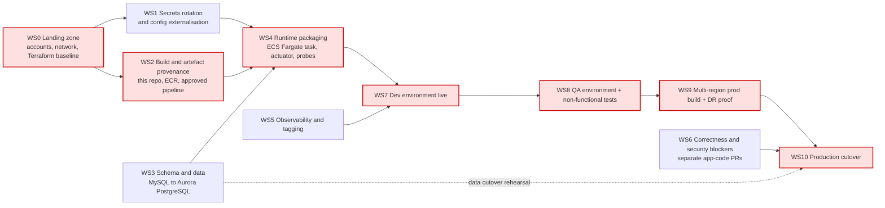

# Migration Plan

Mermaid source — workstream dependency graph

Effort is expressed in Devin sessions for one engineer (one session ≈ one to two human-weeks of
equivalent work). Sequencing, not duration, is what matters here: the calendar is dominated by
answers to the open questions and by account vending, not by engineering throughput.

**Critical path:** WS0 → WS2 → WS4 → WS7 → WS8 → WS9 → WS10. WS3 (data) runs in parallel from the
start but joins the path at WS4 and must be rehearsed again inside WS10. WS6 is off the build path
but is a hard gate on WS10.

**Programme-level entry criteria (before WS0 starts):** Q1 (approved service list) and Q2
(guardrails) answered, and Q4 answered — if the deployed artefact is built from
`LondheShubham153/Springboot-BankApp` rather than this repository (`Jenkinsfile:26`,
`GitOps/Jenkinsfile:21`), the migration scope changes before anything else does.

---

## WS0 — Landing zone and account vending

| | |
|---|---|
| **Entry criteria** | Q1, Q2, Q5 answered; Q6 tag values supplied |
| **Dependencies** | None |
| **Effort** | 1 session (engineering) plus account-vending lead time |

- Vend dev, QA and prod accounts through Control Tower (G4). QA is not requested until dev is running.
- Terraform baseline: remote state, provider/version pinning, module layout, mandatory default tags (G5, G10).
- VPC per account: three AZs, private subnets for tasks and Aurora, public subnets for the ALB only (G8).
- Baseline IAM roles and the SCP posture that enforces the approved-service allowlist (G1).

**Exit:** `terraform apply` from a pipeline creates an empty, compliant dev VPC. No console-built resource exists.

## WS1 — Secrets rotation and config externalisation

| | |
|---|---|
| **Entry criteria** | WS0 dev account exists; Q21 answered (were the committed credentials ever live?) |
| **Dependencies** | WS0 |
| **Effort** | 1 session |

- **Rotate and revoke every credential committed to this repository.** Four locations are recorded as
  S1 in `current-state.md` §7 (`application.properties:4-5`, `docker-compose.yml:7`,
  `docker-compose.yml:26`, `kubernetes/secrets.yaml:8-9`, `helm/bankapp/values.yaml:52-53`). Values are
  not reproduced in this package. Base64 in the Kubernetes Secret is encoding, not protection.
- Treat the values as public: rotate at the database, then revoke, then confirm no other consumer broke (Q11).
- Create the Secrets Manager secret and SSM parameters that WS4 will consume; enable rotation (G8).
- Purging the values from Git history is a separate decision for Security — rotation is what actually closes the exposure.

**Exit:** Security confirms no credential that appears in this repository is valid against any live database.

## WS2 — Build and artefact provenance

| | |
|---|---|
| **Entry criteria** | Q4, Q15, Q16, Q17, Q26 answered |
| **Dependencies** | WS0 |
| **Effort** | 2 sessions |

- Point the pipeline at **this** repository. Today both Jenkins jobs build a different one
  (C1 in `current-state.md` §6) — no change committed here is ever built.
- Onboard to the approved CD tooling (G6); retire `Jenkinsfile`, `GitOps/Jenkinsfile` and the `Shared`
  library in `vars/` once Q18 confirms nothing else uses them.
- Rebuild the image on the approved base (Q15) with a non-root `USER` (`Dockerfile:21-37` declares none)
  and stop skipping tests in the image build (`Dockerfile:25`).
- Push to ECR with immutable tags and scan-on-push (G9); one image identity replaces the four in C3.
- Make the scans blocking: Trivy currently runs with no severity threshold (`vars/trivy_scan.groovy:2`)
  and the SonarQube quality gate is explicitly non-blocking (`vars/sonarqube_code_quality.groovy:3`).
- Resolve dependencies from the internal Maven mirror (Q16).

**Exit:** A commit to this repository produces a scanned, immutably tagged image in ECR, and a failing scan fails the build.

## WS3 — Schema and data migration (MySQL → Aurora PostgreSQL)

| | |
|---|---|
| **Entry criteria** | Q8 (volumes), Q10 (live DDL snapshot), Q11 (other consumers), Q12 (decimal precision) answered |
| **Dependencies** | WS0 for the target Aurora cluster |
| **Effort** | 3 sessions |

This is a workstream, not a table row, but the code makes it far cheaper than a typical engine change:
the repository contains **zero** native SQL, `@Query` annotations, `JdbcTemplate`, `EntityManager` and
stored-procedure usage (zero-counts recorded in `current-state.md` §2). All access is Spring Data JPA
through two repository interfaces. The risk is in the data and the runtime schema, not the queries.

1. Capture the authoritative production DDL (Q10). `spring.jpa.hibernate.ddl-auto=update`
   (`application.properties:9`) never drops anything, so the live schema is a superset of the entities.
2. Author the PostgreSQL baseline as versioned migrations (Flyway/Liquibase) and switch the application to
   `ddl-auto=validate` with `PostgreSQLDialect` (replacing `MySQL8Dialect`, `application.properties:10`).
3. Convert types deliberately: `BigDecimal` balances (`model/Account.java:19`) and amounts
   (`model/Transaction.java:13`) must land as `NUMERIC` with the precision confirmed in Q12 — a silent
   precision change alters money.
4. DMS full load, then CDC if Q8's volumes make a full-load-only window unacceptable.
5. Row-count and checksum validation per table; reconcile every account balance against the sum of its
   transactions before and after.

**Exit:** A rehearsed migration run with signed-off validation output, and a documented rollback.

## WS4 — Runtime packaging on ECS Fargate

| | |
|---|---|
| **Entry criteria** | WS1 secrets exist, WS2 produces an ECR image, WS3 has a target schema; Q3, Q13, Q25 answered |
| **Dependencies** | WS1, WS2, WS3 |
| **Effort** | 2 sessions |

- Terraform: ECS cluster, task definition, service (min 3 tasks / 3 AZs), ALB, target group, ACM certificate, WAF.
- Task role reads the Secrets Manager secret by ARN; no static credentials in the task definition (G8).
- JDBC to Aurora over TLS — every current environment sets `useSSL=false` (`application.properties:3`,
  `kubernetes/configmap.yaml:8`, `docker-compose.yml:25`), which does not survive the security baseline (Q25).
- Add `spring-boot-starter-actuator` (absent from `pom.xml`) so `/actuator/health` — which the Helm chart
  and Compose file already probe (C4) — actually exists, and wire it to the ALB health check.
- Session handling: ALB application-cookie stickiness as the interim (Q13). Today sessions live in each
  JVM with no affinity configured across two replicas.
- Service Auto Scaling replaces the HPA, and the conflicting VPA in the Helm chart (C7) is not carried over.

**Exit:** The application serves traffic through the ALB in dev against Aurora, with a green health check.

## WS5 — Observability, tagging and cost attribution

| | |
|---|---|
| **Entry criteria** | Q6 and Q27 answered |
| **Dependencies** | WS0 (can run in parallel with WS2–WS4) |
| **Effort** | 1 session |

- Structured JSON application logging to CloudWatch Logs; `spring.jpa.show-sql=true`
  (`application.properties:11`) is turned off outside dev.
- Alarms: ALB 5xx and target health, ECS task restarts, Aurora CPU/connections/replica lag, WAF blocks.
- X-Ray tracing; mandatory tag set applied via Terraform default tags (G10).
- Forward to the central observability platform named in Q27.

**Exit:** A dashboard and alarm set exist for dev and are reproduced by Terraform in every environment.

## WS6 — Correctness and security blockers (application-code work)

| | |
|---|---|
| **Entry criteria** | Q22, Q23, Q24, Q30 answered; owner assigned per item |
| **Dependencies** | None technically — but WS10 cannot start until this closes |
| **Effort** | 3 sessions |

**Nothing in this workstream is in the docs-only PR that carries this plan.** Each item is a separate
application-code change, tracked from `current-state.md` §7:

| Ref | Blocker | Evidence |
|---|---|---|
| S2 | Transfers perform four writes with no transaction boundary; `@Transactional` appears zero times in the codebase | `service/AccountService.java:103-135`, zero `@Transactional` in `src/` |
| S3 | No positive-amount validation on deposit, withdraw or transfer — negative amounts are accepted | `service/AccountService.java:51`, `:64`, `:103`, `controller/BankController.java:51`, `:59`, `:83` |
| S4 | CSRF disabled on a cookie-session app with state-changing POSTs | `config/SecurityConfig.java:30` |
| S5 | Single hardcoded `"USER"` authority; no maker-checker, no limits | `service/AccountService.java:99-101` |
| S6 | Hibernate mutates the schema at runtime | `application.properties:9` |
| S7 | No audit logging of financial events | absence across `service/`, `controller/` |
| S8 | Database TLS disabled in every environment | `application.properties:3`, `kubernetes/configmap.yaml:8` |
| S9 | Container runs as root | `Dockerfile:21-37` |
| S10 | Automated test coverage is one `contextLoads()` | `src/test/java/com/example/bankapp/BankappApplicationTests.java:9-11` |

S10 is the enabler: without a real test suite there is no way to evidence that the PostgreSQL migration
preserved behaviour, so build it first (Q30 defines the acceptance criteria).

**Exit:** Each blocker is fixed and merged, or formally accepted in writing by Security and the Application Owner.

## WS7 — Dev environment live

| | |
|---|---|
| **Entry criteria** | WS4 exits; WS5 alarms in place |
| **Dependencies** | WS4, WS5 |
| **Effort** | 0.5 session |

- Multi-AZ, single region (the stated dev posture).
- Full pipeline path exercised: commit → scan → ECR → ECS deploy, with no manual step.
- Dev running is the precondition for requesting the QA account under G4.

**Exit:** Dev is deployed only by the pipeline, and a redeploy from a clean state is demonstrated.

## WS8 — QA environment and non-functional validation

| | |
|---|---|
| **Entry criteria** | WS7 exits; QA account vended; Q30 acceptance criteria agreed |
| **Dependencies** | WS7 |
| **Effort** | 1.5 sessions |

- Terraform-identical to dev; environment differences only in variables (G5).
- Functional acceptance against the migrated Postgres schema, with a production-representative data set from the WS3 rehearsal.
- Load test to establish the real scaling profile — the current HPA settings (1–5 tasks at 40% CPU,
  `kubernetes/bankapp-hpa.yml:11-19`) are inherited assumptions with no measurement behind them.
- Security validation: WAF rules, penetration test, confirmation that no public endpoint exists other than the ALB.

**Exit:** QA signed off by the Application Owner against the Q30 criteria.

## WS9 — Multi-region production build and DR proof

| | |
|---|---|
| **Entry criteria** | WS8 signed off; Q7 (domain), Q9 (RTO/RPO), Q14 (failover mechanism) answered |
| **Dependencies** | WS8 |
| **Effort** | 2 sessions |

- Prod account: primary region full stack, secondary region ALB + standby ECS service + Aurora Global Database secondary.
- Route 53 records in the corporate zone with health checks and failover routing (Q7).
- **Documented DR failover test executed against the production stack before any customer traffic**: promote
  the secondary Aurora cluster, shift Route 53, verify the application serves, and measure achieved RTO/RPO
  against Q9. This is guardrail G7 and it is a test, not a design review.

**Exit:** A signed DR test report with measured RTO/RPO, and the prod stack idle and ready.

## WS10 — Production cutover (final workstream)

| | |
|---|---|
| **Dependencies** | WS9, WS6, WS3 rehearsal |
| **Effort** | 1 session plus the cutover window |

### Entry criteria — all must be true before the window opens

1. **WS6 closed.** Every blocker S2–S10 is fixed and merged, or formally accepted in writing by Security
   and the Application Owner. Migrating an unfixed unatomic-transfer defect into a multi-region
   production estate makes it harder to fix, not easier.
2. **WS1 closed.** Security confirms every credential committed to this repository has been rotated and
   revoked (S1, Q21).
3. **G7 production entry criteria met**: multi-region prod stack live, ALB load balancing in place, and a
   **completed DR failover test with measured RTO/RPO** accepted against Q9 (WS9 exit).
4. **WS3 rehearsed at production scale** with validation output signed off by the DBA, and a rollback
   procedure that has itself been tested.
5. **QA sign-off** against the Q30 acceptance criteria (WS8 exit).
6. Cutover window and downtime agreed and approved (Q28).
7. Operating model in place: named owner, on-call rota, runbooks (Q29), and the tag set applied (Q6).
8. Legacy decommissioning plan agreed, including the EKS cluster, the in-cluster MySQL and its hostPath
   volume (`kubernetes/persistent-volume.yaml:14-15`), and the Docker Hub images.

### Cutover sequence

1. Freeze writes to the legacy application at the start of the window.
2. Final DMS sync; stop replication; run the WS3 validation suite; DBA signs off on the data.
3. Scale up the ECS service in the primary region; verify health checks and a smoke transaction set.
4. Shift Route 53 to the ALB (Q7); watch WAF, ALB 5xx and Aurora metrics through the WS5 alarms.
5. Hypercare: legacy stack kept intact but read-only for the agreed rollback period.
6. Roll back by reverting the Route 53 record and unfreezing legacy — valid only while legacy holds the
   authoritative data, which is why the write freeze in step 1 is non-negotiable.
7. After hypercare, decommission per entry criterion 8.

**Exit:** Production traffic served from AWS, legacy decommissioned, DR test repeatable on a schedule.
