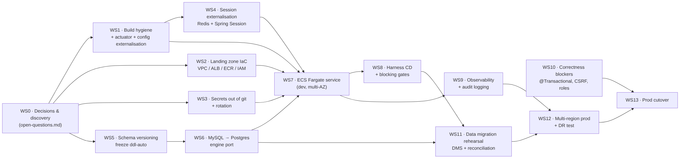
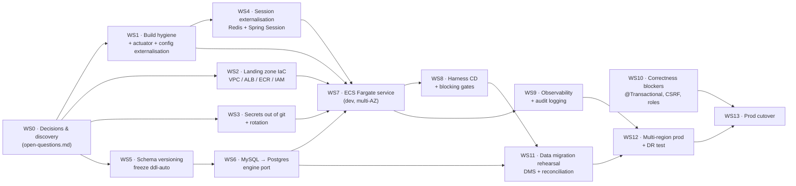

# Migration Sequencing — Springboot-BankApp → AWS

Ordered, independently-reviewable workstreams. Each is sized to land as its own PR (or small PR
series) and to be reviewable without the others being finished. Effort is in **Devin sessions**
(≈1–2 human-weeks each); the long poles are approvals and data, not code.

The plan is gated: **WS0 must complete before anything is built**, because five of its answers
(approved service list, which repo is prod, data volume, downtime window, region/account) change the
design rather than the schedule.

---

## Dependency graph

Diagram source

---

## WS0 — Decisions and discovery *(blocking, no code)*

**Goal:** close the **B1** items in `open-questions.md` and confirm which repository is production.

* Confirm the approved service list (A1) and re-tag every `OFF-LIST?` row in `target-state.md`.
* Resolve A2/A3 — the CI pipeline builds `LondheShubham153/Springboot-BankApp` (`Jenkinsfile:26`),
  the deployment pulls `trainwithshubham/bankapp-eks:v2` (`kubernetes/bankapp-deployment.yml:20`),
  and the CD `sed` targets a filename that does not exist (`GitOps/Jenkinsfile:40`). If prod is fed
  from somewhere else, **re-run current-state analysis against that source before WS1**.
* Obtain a prod `mysqldump --no-data` (B2/B3) and row counts (B1).
* Fix the region/account/hostname unknowns (C2, C3) and the downtime window (B8).

**Exit:** signed-off target-state doc, confirmed source of truth, schema dump in hand.
**Depends on:** nothing. **Effort:** 0.5 (elapsed time dominated by external responses).

## WS1 — Build hygiene and 12-factor config *(app repo)*

* Remove the `source`/`target` `1.8` override in `pom.xml:78-86` that contradicts
  `java.version=17` (`pom.xml:30`).
* Replace `mysql:mysql-connector-java` (`pom.xml:54-59`) with maintained coordinates (interim step;
  superseded by WS6).
* Replace the deprecated `openjdk:17-alpine` base image (`Dockerfile:28`) with a supported JRE base;
  build with tests enabled (drop `-DskipTests=true`, `Dockerfile:21`).
* **Add `spring-boot-starter-actuator`** and expose `/actuator/health` — currently referenced by
  `docker-compose.yml:36` and `helm/bankapp/templates/deployment.yml:45,51` but not present, so
  those probes can never pass. Required for ALB target-group health checks.
* Externalise all datasource config; delete credentials from `application.properties:4-5`; turn off
  `spring.jpa.show-sql` (`application.properties:11`).

**Depends on:** WS0. **Reviewable alone:** yes — no infra change. **Effort:** 0.75.

## WS2 — Landing zone and IaC baseline

VPC (3 AZs, private subnets), ALB + ACM + Route 53, ECR with immutable tags and scan-on-push, IAM
task/execution roles, VPC endpoints for ECR/Secrets Manager/CloudWatch/S3. All as CloudFormation/CDK
(or Terraform if C1/A1 permit) — the current environment has **no IaC at all**, only `eksctl`
commands in `README.md:62-82`.

**Depends on:** WS0. **Effort:** 2.

## WS3 — Secrets out of source control

* Move DB credentials to Secrets Manager with rotation; non-secret config to Parameter Store.
* **Rotate the leaked credential.** `Test@123` is committed in four places
  (`application.properties:5`, `kubernetes/secrets.yaml:8-9`, `helm/bankapp/values.yaml:52-53`,
  `docker-compose.yml:7,26`). Moving it is not sufficient — if it is the real prod password it is
  already compromised (E1).
* Purge committed secrets from the working tree and decide on history rewriting with Security.

**Depends on:** WS0. **Effort:** 1.

## WS4 — Session externalisation

Add Spring Session + ElastiCache Redis. Today sessions live in JVM memory with **2 replicas and no
stickiness** (`kubernetes/bankapp-deployment.yml:9`), so horizontal scaling on Fargate is unsafe
until this lands. Verify by scaling to ≥2 tasks and confirming login survives task restarts.

**Depends on:** WS1. **Effort:** 0.5.

## WS5 — Schema versioning (freeze `ddl-auto`)

Introduce Flyway/Liquibase, baseline from the prod dump obtained in WS0, and set
`spring.jpa.hibernate.ddl-auto=validate` — today it is `update` (`application.properties:9`), so
Hibernate mutates production schema at every startup and **no versioned schema artefact exists**.
Reconcile any drift between the live schema and the entity classes (`Account.java`,
`Transaction.java`), including the `BigDecimal` precision question (B5).

**Depends on:** WS0 (needs the dump). **Blocks:** WS6. **Effort:** 1.

## WS6 — MySQL → PostgreSQL engine port

Swap driver and dialect (`application.properties:3,6,10`), convert the baselined migrations to
Postgres, and stand up RDS PostgreSQL Multi-AZ with PITR and KMS encryption. Enforce TLS in transit
— every current connection string sets `useSSL=false` (`application.properties:3`,
`kubernetes/configmap.yaml:8`, `docker-compose.yml:25`).

Low code risk by construction: **0 native queries, 0 stored procedures, 0 `JdbcTemplate` usages**
(see `current-state.md` §3). Risk concentrates in schema conversion, identity/sequence semantics,
and `numeric` precision — not in application SQL. Add repository/service integration tests against
Testcontainers-Postgres; the repo's only test today is `contextLoads()`
(`src/test/java/com/example/bankapp/BankappApplicationTests.java:9-11`).

**Depends on:** WS5. **Effort:** 2.

## WS7 — ECS Fargate service (dev, multi-AZ)

Task definition, service with min 2 tasks across AZs, target-tracking autoscaling (replacing the
HPA's `minReplicas: 1`, `kubernetes/bankapp-hpa.yml:11`), ALB target group on `/actuator/health`,
`awslogs` driver. Drop the Helm VPA-in-`Auto`-mode + HPA pairing
(`helm/bankapp/templates/vpa.yaml:12`) — unsupported and not carried forward. Self-host the three
CDN assets (`dashboard.html:5,194-196`) behind S3/CloudFront if C8 permits.

**Depends on:** WS1, WS2, WS3, WS4, WS6. **Effort:** 1.

## WS8 — Harness CD and enforcement of gates

Blue/green ECS deployment with automated rollback, replacing the Jenkins `sed`-and-push GitOps loop
(`GitOps/Jenkinsfile:35-67`). Make quality gates actually blocking: today
`waitForQualityGate abortPipeline: false` (`vars/sonarqube_code_quality.groovy:3`) and `trivy fs .`
with no `--exit-code` (`vars/trivy_scan.groovy:2`) cannot fail a build. Retire ArgoCD and Docker Hub
from the release path. Decommission the Gmail SMTP notification (`GitOps/Jenkinsfile:72-91`) in
favour of Harness notifications.

**Depends on:** WS7. **Effort:** 1.5.

## WS9 — Observability and audit logging

CloudWatch Logs/Metrics/Alarms + Container Insights; structured JSON logging; **and the audit trail
that does not exist today** — no deposit, withdrawal, or transfer is logged anywhere in
`AccountService.java`. Archive audit events to S3 with Object Lock per the retention answer (E4).
Define SLOs, alarms, and runbooks (F5).

**Depends on:** WS7. **Effort:** 1.

## WS10 — Correctness blockers *(parallel track, app code)*

Not migration work, but **cutover blockers**:

* Make `transferAmount` atomic — four independent writes with no `@Transactional`
  (`AccountService.java:103-135`); multi-AZ failover widens the partial-transfer window.
* Re-enable CSRF (`SecurityConfig.java:30`) on money-moving POSTs (`BankController.java:50,58,82`).
* Replace the single hardcoded `"USER"` authority (`AccountService.java:99-101`) with a real role
  model; revisit open `/register` (`SecurityConfig.java:32`).
* Validate amounts are positive — `deposit`/`withdraw`/`transferAmount` accept negatives today
  (`AccountService.java:51,64,103`).

**Depends on:** WS0 (scope decision A4). Runs in parallel from the start. **Effort:** 1.5.

## WS11 — Data migration rehearsal

DMS full-load + CDC MySQL→Postgres (or dump-and-load if the WS0 downtime answer allows), with a
row-count and checksum reconciliation harness over `account` and `transaction`, and a documented,
rehearsed rollback. Rehearse at least twice against production-sized data. **Do not schedule cutover
until a rehearsal has passed end to end.**

**Depends on:** WS6, WS8. **Effort:** 1.5.

## WS12 — Multi-region prod topology and DR test

Cross-region RDS read replica, warm-standby ECS service, Route 53 failover, WAF, and a **executed**
(not documented) regional failover test against the RTO/RPO agreed in F8.

**Depends on:** WS9, WS11. **Effort:** 2.

## WS13 — Production cutover

Freeze → final CDC sync → DNS switch → smoke tests → monitored soak → decommission EKS, in-cluster
MySQL, Docker Hub images, ArgoCD, and the Jenkins CD job.

**Entry criteria (all mandatory):**

1. WS10 merged and verified — atomic transfers, CSRF, roles, amount validation.
2. WS11 rehearsal passed with clean reconciliation and a rehearsed rollback.
3. WS12 failover test executed against the agreed RTO/RPO.
4. Every **B3** item in `open-questions.md` closed (audit retention E4, release gates D4, credential
   ownership D5, external endpoint allow-lists C9, CSRF risk acceptance E8).
5. Leaked credentials from WS3 rotated and confirmed dead.

**Depends on:** WS10, WS12. **Effort:** 0.5 plus the agreed outage window.

---

## Critical path and totals

Critical path: **WS0 → WS5 → WS6 → WS7 → WS8 → WS11 → WS12 → WS13** ≈ **11 sessions**.
Total across all workstreams ≈ **17 sessions**, of which ~4 (WS2, WS3 partially, WS10) run in
parallel off the critical path.

Elapsed time is dominated by things that are not engineering: WS0's external answers, credential
rotation approval, the DR test window, and the cutover change approval. Those should be started on
day one, in parallel with WS1.
