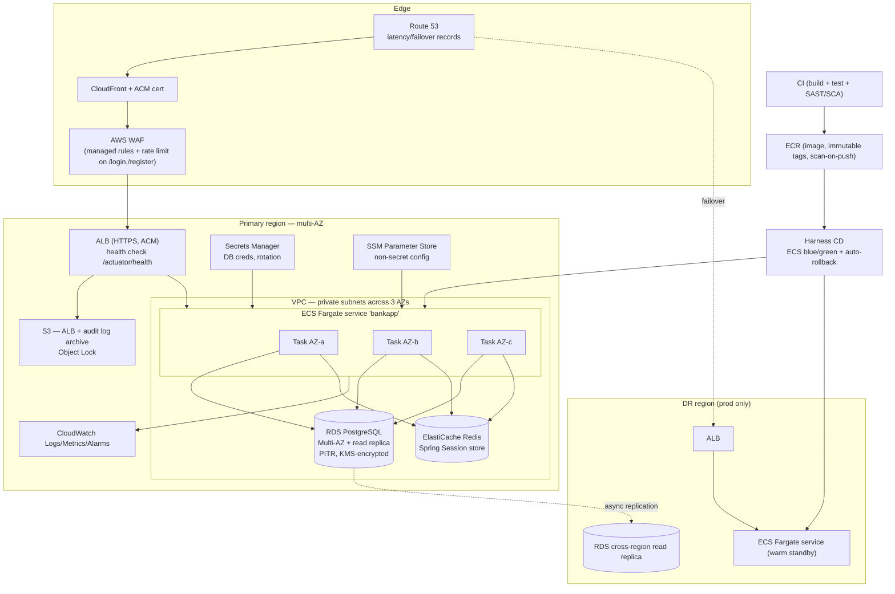

# Target-State Architecture on AWS — Springboot-BankApp

## 0. Constraint set used

| Constraint | Value |
|---|---|
| Availability | Multi-AZ in dev; multi-region in prod |
| Target RDBMS | PostgreSQL |
| Compute | Containers on ECS Fargate |
| CD tool | Harness |

> **Approved-service list: NOT SUPPLIED.** The request carried the literal placeholder
> `[PASTE BLESSED SERVICE LIST]`. Nothing was silently substituted. This document is written
> against the **assumed list below**, and every choice is tagged so the list can be diffed against
> the real one in one pass. Any row tagged **`OFF-LIST?`** is a service that is *not* in the assumed
> list, or that is commonly excluded from a bank's blessed catalogue — each of those rows carries an
> explicit in-list fallback.
>
> **Assumed list:** VPC, ALB, ECS Fargate, ECR, RDS for PostgreSQL, ElastiCache for Redis, S3,
> SQS, SNS, Secrets Manager, SSM Parameter Store, CloudWatch (Logs/Metrics/Alarms), KMS, IAM,
> Route 53, AWS WAF, ACM, SES, CloudFront, plus Harness for CD.

---

## 1. Target diagram

---

## 2. Component-by-component mapping

Effort is expressed in **Devin sessions** (one session ≈ 1–2 human-weeks of focused work).

| # | Current component (evidence) | Target AWS service | Rationale | Risk | Effort |
|---|---|---|---|---|---|
| 1 | Spring Boot 3.3.3 app, 2 pods on EKS (`pom.xml:8`, `kubernetes/bankapp-deployment.yml:9,19-20`) | **ECS Fargate** service, 3 tasks across 3 AZs, behind ALB | Mandated compute target; app is stateless once sessions externalise (#5). No EKS control plane to own. | **M** | 1 |
| 2 | NGINX Ingress + cert-manager + Let's Encrypt (`bankapp-ingress.yml:10-18`, `letsencrypt-clusterissuer.yaml:7-8`) | **ALB** + **ACM** + **Route 53** | ALB is the native ECS ingress; ACM replaces cert-manager/Let's Encrypt entirely, including renewal. HTTP-01 solver disappears. | **L** | 0.5 |
| 3 | In-cluster MySQL 8.0, 1 replica (`mysql-deployment.yml:9,20`) | **RDS for PostgreSQL**, Multi-AZ, PITR, KMS-encrypted, cross-region read replica in prod | Mandated RDBMS. Removes the single-replica/no-backup failure mode outright. **This is an engine change, not a lift** — see #4. | **H** | 2 |
| 4 | MySQL dialect + JDBC driver + `ddl-auto=update` (`application.properties:9-10`, `pom.xml:54-59`) | **RDS PostgreSQL** + `org.postgresql:postgresql` + **Flyway/Liquibase baseline** | Hibernate hides most SQL dialect differences (there are **0** native queries and **0** stored procs — `current-state.md` §3), so the code change is driver + dialect + a `BigDecimal`/`numeric` precision review. The real work is that **no versioned schema exists**: the schema must be extracted from the live DB, converted, and frozen into migrations before `ddl-auto` is turned off. | **H** | 1.5 |
| 5 | In-JVM HTTP sessions, no sticky sessions (`SecurityConfig.java:35-40`, no `spring-session` in `pom.xml`) | **ElastiCache for Redis** + Spring Session | Required before any horizontal scaling on Fargate; today 2 replicas already break login (`current-state.md` §6). ALB stickiness is the in-list fallback if Redis is disallowed, but it does not survive task replacement. | **M** | 0.5 |
| 6 | hostPath PV `/mnt/data/mysql`, 10Gi (`persistent-volume.yaml:14-16`) | **Deleted** — absorbed by RDS storage | Node-local state is the biggest data-loss risk today and has no target-state equivalent. | **L** | 0 (with #3) |
| 7 | Docker Hub `madhupdevops/bankapp` etc. (`vars/docker_push.groovy:5`, four divergent image refs) | **ECR** — private, immutable tags, scan-on-push | Removes an unauthenticated public dependency from the release path and collapses the four-image mismatch into one registry. | **L** | 0.5 |
| 8 | Jenkins CI (`Jenkinsfile:1-87`) | **CI stays where the org's CI stays** — the constraint names Harness for **CD** only. Jenkins may remain as CI, publishing to ECR. | Not a stated migration target; keeping CI stable de-risks the CD swap. **Must be confirmed** — see `open-questions.md` Q17. | **M** | 1 |
| 9 | Jenkins CD via `sed` + git push + ArgoCD (`GitOps/Jenkinsfile:35-67`) | **Harness CD** — ECS blue/green with automated rollback | Mandated CD tool. Replaces the broken `sed` (targets a non-existent filename, `GitOps/Jenkinsfile:40`) and the manifest-mutation GitOps loop. Gives the rollback path that does not exist today. | **M** | 1 |
| 10 | Trivy fs scan, OWASP DC, SonarQube — none blocking (`vars/trivy_scan.groovy:2`, `vars/sonarqube_code_quality.groovy:3`) | **ECR scan-on-push** (+ existing SAST/SCA promoted to **blocking** Harness gates) | Scanning already exists; it just cannot fail a build. The change is policy, not tooling. | **L** | 0.5 |
| 11 | Secrets in git: `application.properties:4-5`, `secrets.yaml:8-9`, `helm/bankapp/values.yaml:52-53`, `.env:1-2` | **Secrets Manager** (DB creds + rotation) and **SSM Parameter Store** (non-secret config), injected as ECS task-definition `secrets`/`environment` | Every credential in this system is currently committed to source control. Rotation is impossible today. | **H** (leaked creds must be rotated, not just moved) | 1 |
| 12 | ConfigMap `bankapp-config` (`configmap.yaml:6-9`) | **SSM Parameter Store** per environment | Direct equivalent; also fixes the `bankappdb` vs `BankDB` name drift by making config explicit per env. | **L** | 0.25 |
| 13 | Prometheus + Grafana via `kube-prometheus-stack` (`README.md:308,332`) | **CloudWatch** Logs/Metrics/Alarms + Container Insights | In-list and native to Fargate. **`OFF-LIST?`** if the org standardises on Amazon Managed Grafana/Prometheus — those are not in the assumed list; if they are on the real list, prefer them to preserve existing dashboards. | **L** | 0.5 |
| 14 | Structured app logs: **none**; stdout only, `show-sql=true` (`application.properties:11`) | **CloudWatch Logs** via `awslogs` driver + **S3** archive with Object Lock for the audit trail | There is no audit log of financial events today (`current-state.md` §7). Regulated workload: this is a gap to fill, not a component to move. `show-sql` must be turned off — it logs statement data. | **M** | 0.5 |
| 15 | HPA 1–5 pods @40% CPU (`bankapp-hpa.yml:11-19`) + Helm VPA in `Auto` mode (`helm/bankapp/templates/vpa.yaml:12`) | **ECS Service Auto Scaling** (target tracking), min **2** | Direct equivalent. The VPA-plus-HPA combination is dropped (unsupported pairing). `minReplicas: 1` today defeats the deployment's own HA intent — target min is 2. | **L** | 0.25 |
| 16 | Missing `/actuator/health` while probes reference it (`docker-compose.yml:36`, `helm/.../deployment.yml:43-54`) | **Actuator dependency added**; ALB + ECS health checks point at `/actuator/health` | ALB target-group health checks are mandatory for Fargate. This is the one **application-code** change that is unavoidable — it is *not* in this PR and must be a separate, reviewed change. | **M** | 0.25 |
| 17 | Public CDN assets: bootstrapcdn, jquery, jsdelivr (`dashboard.html:5,194-196`) | **S3 + CloudFront** (self-hosted assets) | Removes third-party runtime dependencies from a banking UI (supply-chain and availability exposure), and removes the browser's dependency on egress to three external origins. | **L** | 0.25 |
| 18 | SMTP via Gmail:465 from Jenkins (`GitOps/Jenkinsfile:72-91`, `README.md:189`) | **SES** for any application mail; Harness native notifications for pipeline mail | Gmail app passwords in a CD pipeline are not an acceptable prod dependency. Note the **application sends no mail at all today** — this is CI/CD-only. | **L** | 0.25 |
| 19 | `eksctl` CLI commands in markdown; **no IaC** (`README.md:62-82`) | **Terraform** (or CDK/CloudFormation) for VPC, ECS, RDS, ALB, Redis, IAM | **`OFF-LIST?`** — Terraform is third-party and not in the assumed list. In-list alternative: **CloudFormation** (or CDK, which synthesises to CloudFormation). Either is acceptable; what is not acceptable is carrying forward zero IaC. | **M** | 2 |
| 20 | Self-service open registration, single `"USER"` authority, CSRF disabled (`SecurityConfig.java:30-34`, `AccountService.java:99-101`) | **WAF** rate-limiting on `/login` and `/register` as a compensating control; role model and CSRF are **app-code fixes** | AWS cannot fix an authorisation model. WAF buys time; the code must change. Out of scope for the migration but a hard blocker for prod cutover. | **H** | 1 (separate track) |
| 21 | Non-atomic `transferAmount`, no `@Transactional` (`AccountService.java:103-135`) | No AWS service maps to this | **Flagged deliberately**: multi-AZ failover and task replacement make partial-transfer windows *more* likely. Must be fixed **before** cutover, not after. | **H** | 0.5 (separate track) |
| 22 | Docker Compose + nginx single-host path (`docker-compose.yml`, `nginx.md:30-52`) | **Retired** | Superseded by ECS. Keep only as a local-dev convenience. | **L** | 0 |
| 23 | ArgoCD (`kubernetes/README.md:93-106`) | **Retired** — Harness owns deployment state | GitOps-manifest mutation has no role once Harness drives ECS task definitions. | **L** | 0 |
| 24 | *(no current equivalent)* | **SQS / SNS** | Not needed. The app has **zero** async or queue-based work (no `@Scheduled`, no messaging client). Listed only to record that the in-list messaging services are deliberately unused. | — | 0 |

**Total first-pass effort: ~14 Devin sessions**, of which ~4 are the database engine change and its
schema-versioning prerequisite, and ~2.5 are application-correctness fixes (rows 16, 20, 21) that
are *not* migration work but *are* cutover blockers.

---

## 3. Off-list / needs-confirmation summary

| Item | Why it may be off-list | In-list alternative proposed |
|---|---|---|
| Terraform (row 19) | Third-party IaC; many banks mandate CloudFormation/CDK | **CloudFormation or CDK** |
| Amazon Managed Grafana / Managed Prometheus (row 13) | Not in the assumed list; would preserve existing dashboards | **CloudWatch + Container Insights** |
| ElastiCache for Redis (row 5) | In the assumed list, but sometimes restricted | **ALB stickiness** (weaker: sessions lost on task replacement) |
| Jenkins as ongoing CI (row 8) | Constraint names Harness for CD only; CI ownership unstated | **Harness CI**, if the org wants a single tool |
| CloudFront (row 17) | In the assumed list; confirm it is permitted for authenticated banking origins | **ALB-only**, assets served from the jar as today |

## 4. Explicit non-goals

* No application functional change in this package — docs only.
* Multi-**region** applies to prod only; dev is multi-AZ single-region (per constraint).
* Data migration mechanics (MySQL → Postgres tooling, cutover window, reconciliation) are sequenced
  in `migration-plan.md`; the volume and downtime inputs needed to size them are unknown and are
  raised in `open-questions.md`.
