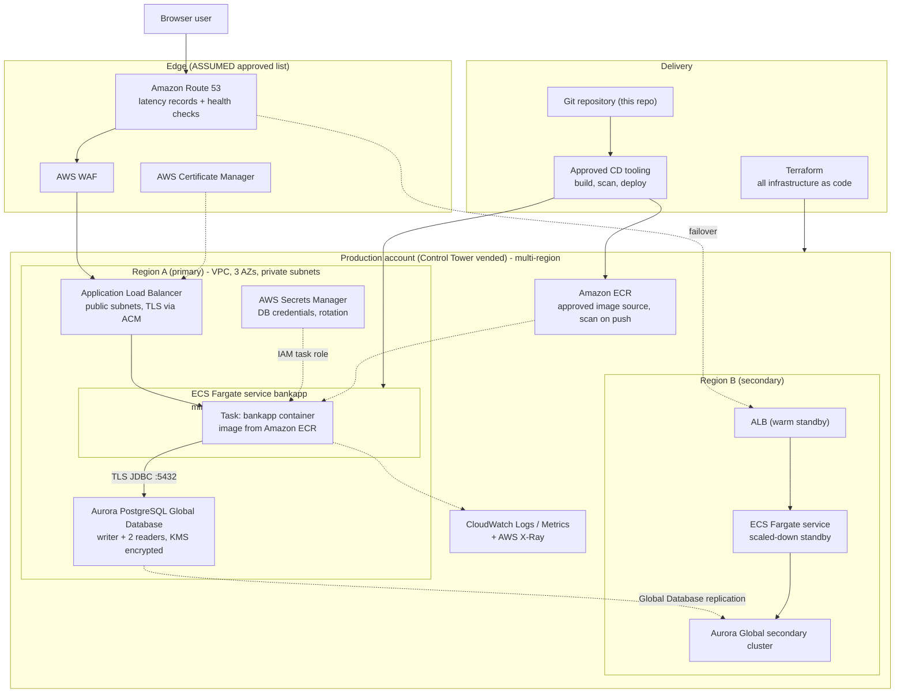

# Target State — AWS

Mermaid source — target AWS architecture

## 0. Inputs that were not supplied — read this first

> **ASSUMED, NOT CUSTOMER-SUPPLIED.** No approved ("blessed") AWS service list and no platform
> migration guardrails were provided for this engagement. Everything in §1 and §2 below is an
> assumption made so that design work could start. It is not the customer's policy and must not be
> quoted as such. Confirming or replacing both is open question **Q1** and **Q2** in
> `open-questions.md`, addressed to Platform Engineering, and both are entry criteria for WS0 in
> `migration-plan.md`.

Environment assumptions, also supplied as assumptions rather than confirmed requirements:

| Assumption | Value |
|---|---|
| Dev resilience posture | Multi-AZ, single region |
| Production resilience posture | Multi-region (active/warm-standby) |
| Target RDBMS | Amazon Aurora PostgreSQL |
| Target compute | Amazon ECS on Fargate (containers-first) |
| IaC | Terraform |
| CD | The organisation's approved pipeline tooling (specific product unconfirmed — Q14) |

## 1. ASSUMED approved service list

Only these services are used in the target design. Anything the design needed that is not on this
list is tagged `OFF-LIST?` in §3 with an in-list alternative.

| Domain | Services |
|---|---|
| Accounts and governance | AWS Organizations, AWS Control Tower, AWS IAM, AWS Config, AWS CloudTrail |
| Network | Amazon VPC, AWS Transit Gateway, Amazon Route 53, AWS WAF, Elastic Load Balancing (ALB) |
| Compute | Amazon ECS on AWS Fargate |
| Containers and artefacts | Amazon ECR |
| Data | Amazon Aurora PostgreSQL (incl. Global Database), Amazon S3, AWS Database Migration Service (DMS) |
| Security | AWS KMS, AWS Secrets Manager, AWS Systems Manager Parameter Store, AWS Certificate Manager, Amazon GuardDuty, AWS Security Hub |
| Observability | Amazon CloudWatch (Logs, Metrics, Alarms), AWS X-Ray |
| Integration | Amazon EventBridge, Amazon SNS |

## 2. Platform migration guardrails in force

> **ASSUMED DEFAULTS.** The customer supplied no guardrails; this is the playbook's default set,
> reproduced so that every design choice can be assessed against something explicit. Replace it with
> the customer's own once Q2 is answered.

| # | Guardrail |
|---|---|
| G1 | **Approved-service allowlist** — only services on the approved list may appear in the target architecture; the allowlist is assumed to be enforced organisation-wide by service control policies (SCPs). |
| G2 | **Containers first** — the approved managed container platform is the preferred compute target; VM-based lift-and-shift requires explicit justification. |
| G3 | **Standard target RDBMS** — relational workloads target the organisation's standard engine (PostgreSQL); staying on a non-standard engine is an exception that must be justified and flagged. |
| G4 | **Account vending and environment promotion** — workloads are onboarded through the standard account-vending process (AWS Control Tower) with separate dev, QA and prod accounts; a dev account must be running before QA is granted; changes promote dev → QA → prod. |
| G5 | **Everything as code** — all target infrastructure is defined in Terraform; no console-built resources. |
| G6 | **Approved delivery toolchain** — CI/CD runs on the organisation's approved pipeline tooling; migrating off legacy pipelines is part of the plan. |
| G7 | **Production entry criteria** — prod deployment requires multi-region, load balancing and a demonstrated DR/failover test before approval. |
| G8 | **Security baseline** — private networking by default, encryption in transit and at rest, least-privilege IAM roles with no long-lived static credentials, secrets in the approved secrets manager. |
| G9 | **Approved artefact sources** — container images and dependencies only from approved registries/repositories. |
| G10 | **Tagging and observability standards** — mandatory tags (owner, cost centre, environment, data classification) and logs/metrics to the central observability platform. |

## 3. Component-by-component target

Effort is engineering effort for one engineer, expressed in Devin sessions (one session ≈ one to two
human-weeks of equivalent work).

| # | Current component | Evidence | Target AWS service | Rationale | Risk | Effort |
|---|---|---|---|---|---|---|
| 1 | Spring Boot 3.3.3 web app on EKS, 2 replicas | `kubernetes/bankapp-deployment.yml:9-20` | **Amazon ECS on Fargate**, min 3 tasks spread across 3 AZs | G2 containers-first; the app is already a single stateless container with no daemonset/operator/CRD needs, so Fargate removes node-group ownership (`README.md:74-85`) without a repackaging cost | L | 1 session |
| 2 | Container image `openjdk:17-alpine`, root user, tests skipped | `Dockerfile:21-37` | Rebuilt image on an **approved base image from ECR**, non-root user, tests run in the build | G9 approved artefact sources; G8 least privilege. `openjdk:17-alpine` is an unmaintained Docker Hub tag | M | 0.5 session |
| 3 | Docker Hub registry (`madhupdevops`, `trainwithshubham`, `joakim077`) | `Jenkinsfile:74`, `.env:1-2` | **Amazon ECR** with scan-on-push and immutable tags | G9; also resolves C3 — one image identity replaces four | L | 0.5 session |
| 4 | In-cluster MySQL 8, 1 replica, hostPath PV | `kubernetes/mysql-deployment.yml:9-41`, `kubernetes/persistent-volume.yaml:14-15` | **Aurora PostgreSQL** (Global Database in prod), Multi-AZ, KMS-encrypted, automated backups | G3 standard engine; a single-replica hostPath database is not survivable — the data is pinned to one node's local disk | **H** | 3 sessions (see WS3) |
| 5 | Hibernate `MySQL8Dialect`, `ddl-auto=update` | `application.properties:9-10` | `PostgreSQLDialect`, `ddl-auto=validate`, schema owned by a migration tool | Engine change plus G-compliant change control; zero native SQL and zero stored procedures (see current-state §2 negatives) is what keeps this from being a rewrite | M | included in row 4 |
| 6 | Schema evolution by Hibernate at runtime | `application.properties:9` | **Flyway or Liquibase** running as a pipeline step (application-level tooling, not an AWS service) | Makes the schema a reviewable artefact; prerequisite for promoting dev → QA → prod under G4 | M | 0.5 session |
| 7 | NGINX Ingress Controller + cert-manager + Let's Encrypt | `kubernetes/bankapp-ingress.yml:6-18`, `kubernetes/letsencrypt-clusterissuer.yaml:6-14` | **ALB** + **AWS Certificate Manager** + **AWS WAF** | G7 load balancing; ACM removes the outbound ACME dependency and the renewal failure mode | L | 0.5 session |
| 8 | Host `megaproject.trainwithshubham.com` | `kubernetes/bankapp-ingress.yml:15-18` | **Route 53** record in the corporate zone, latency/failover routing across the two regions | Third-party demo domain cannot go to production; failover routing is the mechanism for G7 multi-region | L | 0.25 session |
| 9 | Committed DB credentials (4 locations) | current-state §7 S1 | **AWS Secrets Manager**, injected into the task definition by ARN, rotation enabled | G8 no secrets in code. Rotation and revocation of the exposed values is WS1 work, not a rename | **H** | 1 session |
| 10 | Non-secret config in ConfigMap | `kubernetes/configmap.yaml:6-9` | **SSM Parameter Store** parameters referenced by the task definition | G5/G8; keeps environment differences out of the image | L | 0.25 session |
| 11 | HPA 1–5 @40% CPU (plus a conflicting VPA in the Helm chart) | `kubernetes/bankapp-hpa.yml:11-19`, `helm/bankapp/templates/vpa.yaml:12` | **ECS Service Auto Scaling** target-tracking on CPU, min 3 / max 10 | Single scaling mechanism; min 3 keeps one task per AZ, resolving C8 | L | 0.25 session |
| 12 | Jenkins CI + Jenkins GitOps CD + ArgoCD (documented only) | `Jenkinsfile`, `GitOps/Jenkinsfile`, `kubernetes/README.md:121-131` | **Approved CD tooling** driving build → ECR → ECS deploy, with Trivy/SCA/SAST gates that actually fail the build | G6. Also fixes C1 (pipeline builds the wrong repository) and C2 (`sed` on a non-existent filename) | **H** | 2 sessions |
| 13 | Raw Kubernetes manifests + a divergent Helm chart | `kubernetes/**`, `helm/**` | **Terraform** modules (VPC, ALB, ECS, Aurora, IAM, observability); both existing descriptor sets retired | G5 everything as code; C5 disappears because there is one description of the system | M | 2 sessions |
| 14 | No probes (K8s) / probes on a non-existent `/actuator/health` (Helm, Compose) | `kubernetes/bankapp-deployment.yml:44-55`, `helm/bankapp/templates/deployment.yml:43-54` | Add `spring-boot-starter-actuator`, expose `/actuator/health` unauthenticated, wire it to the **ALB target-group health check** and the ECS container health check | Without a real health endpoint the ALB cannot deregister a broken task; this is a prerequisite for G7 | M | 0.25 session |
| 15 | In-JVM HTTP sessions across 2 replicas, no sticky sessions | current-state §8 | **ALB sticky sessions (application cookie)** as the interim, stateless auth as the target | Preserves behaviour on day one without adding a session store; see the `OFF-LIST?` row below (Q13) | M | 0.5 session |
| 16 | `show-sql=true`, no application logging, no metrics | `application.properties:11` | **CloudWatch Logs** (structured JSON via `awslogs`), CloudWatch metrics and alarms, **X-Ray** tracing | G10; also the only way to evidence the audit-logging gap S7 being closed | L | 0.5 session |
| 17 | Bootstrap/jQuery/Popper from public CDNs | `templates/dashboard.html:194-196` | Vendored into the image from the approved internal artefact repository, served by the app | G9 approved sources; removes three public-internet dependencies from a page that renders account balances | L | 0.25 session |
| 18 | Jenkins `emailext` build notification | `GitOps/Jenkinsfile:72-91` | **Amazon SNS** topic subscribed by the delivery team | G1 keeps notification on an in-list service | L | 0.1 session |
| 19 | Manual cluster creation with `eksctl` by a root user | `README.md:20-23`, `:62-85` | **Control Tower**-vended dev / QA / prod accounts, Terraform-provisioned | G4; `sudo su` plus static IAM access keys is the opposite of G8 | M | 1 session (WS0) |
| 20 | MySQL data on a node's local disk | `kubernetes/persistent-volume.yaml:14-15` | **DMS** for the migration itself, **S3** for dumps/validation artefacts, Aurora automated backups + PITR thereafter | Removes the single-node data-loss mode; DMS gives a rehearsable, resumable cutover | **H** | included in row 4 |

### `OFF-LIST?` items

| Need | Natural choice | Status | In-list alternative used instead |
|---|---|---|---|
| Shared HTTP session store so any task can serve any request | Amazon ElastiCache for Redis (with Spring Session) | `OFF-LIST?` — not on the ASSUMED list | ALB application-based sticky sessions now (row 15); move to stateless authentication so no store is needed. Raised as Q13 |
| Cross-region traffic steering with sub-minute failover | AWS Global Accelerator | `OFF-LIST?` | Route 53 failover records with health checks; slower failover, bounded by DNS TTL. Raised as Q14 |
| Managed CI runners | AWS CodeBuild / CodePipeline | `OFF-LIST?` (the org's approved pipeline tooling is assumed to be non-AWS) | The organisation's approved pipeline tooling, per G6. Raised as Q17 |
| Centralised WAF/log analytics beyond CloudWatch | Amazon OpenSearch Service | `OFF-LIST?` | CloudWatch Logs Insights plus forwarding to the central observability platform named in G10. Raised as Q27 |
| Kubernetes, if the customer's standard container platform is EKS rather than ECS | Amazon EKS | `OFF-LIST?` on the ASSUMED list | ECS Fargate (row 1). If Q3 confirms EKS is the standard, rows 1, 11 and 13 change; nothing else in this design does. Raised as Q3 |

## 4. Guardrail compliance

| # | Guardrail | How the target design satisfies it | Exception / open item |
|---|---|---|---|
| G1 | Approved-service allowlist | Every service in §3 comes from the ASSUMED list in §1; the five services that did not fit are tagged `OFF-LIST?` with an in-list substitute rather than silently adopted | The list itself is assumed — Q1 |
| G2 | Containers first | ECS Fargate (row 1); no EC2 instances, no VM lift-and-shift; the application is already containerised (`Dockerfile:1-37`) | Q3 if the standard platform is EKS |
| G3 | Standard target RDBMS | MySQL 8 → Aurora PostgreSQL (rows 4–5); feasible at low code risk because the repo contains zero native SQL, zero stored procedures and zero `@Query` annotations | None. Data-migration risk remains H |
| G4 | Account vending and promotion | Control Tower dev / QA / prod accounts (row 19); WS7 delivers dev, WS8 QA, WS9/WS10 prod, in that order and no earlier | Q5 (is there an existing landing zone?) |
| G5 | Everything as code | Terraform modules (row 13) replace the raw manifests and the Helm chart; no console changes | None |
| G6 | Approved delivery toolchain | Jenkins CI/CD retired in WS2 (row 12); scans become blocking gates instead of the current advisory ones (`vars/sonarqube_code_quality.groovy:3`, `vars/trivy_scan.groovy:2`) | Q17 names the tool |
| G7 | Production entry criteria | Multi-region prod (Aurora Global Database + standby ECS service + Route 53 failover), ALB load balancing, and a documented DR failover test as a WS9 exit criterion and WS10 entry criterion | Q9 (RTO/RPO define whether warm standby is sufficient), Q14 |
| G8 | Security baseline | Tasks and Aurora in private subnets, only the ALB public; TLS at the ALB via ACM and TLS-enforced JDBC to Aurora (replacing `useSSL=false`, `application.properties:3`); KMS at rest; IAM task roles instead of the static keys in `README.md:36`; Secrets Manager (row 9) | The committed credentials must be rotated and revoked — WS1, tracked from S1 |
| G9 | Approved artefact sources | ECR for images (row 3), approved base image (row 2), vendored front-end assets (row 17), dependencies from the internal Maven mirror | Q16 names the internal mirror |
| G10 | Tagging and observability | Mandatory tag set applied by Terraform default tags; CloudWatch logs/metrics and X-Ray (row 16); alarms on ALB 5xx, task health, Aurora replica lag | Q27 confirms the mandatory tag keys and the central platform |
