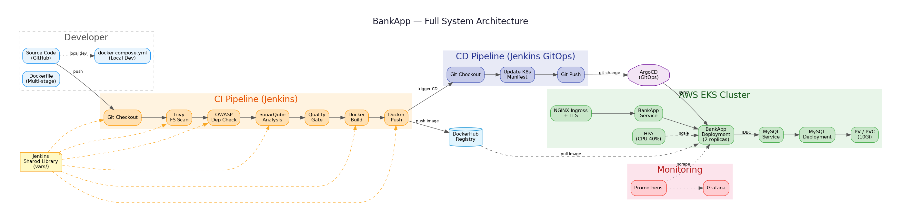
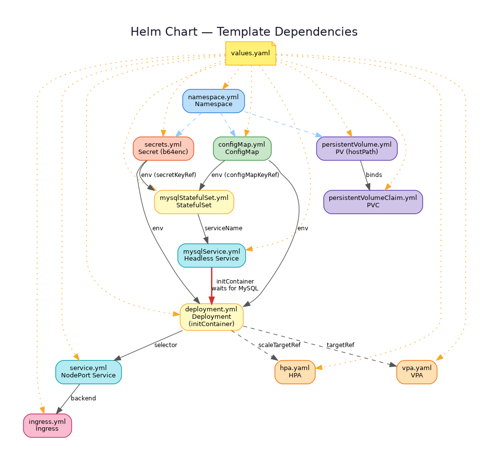
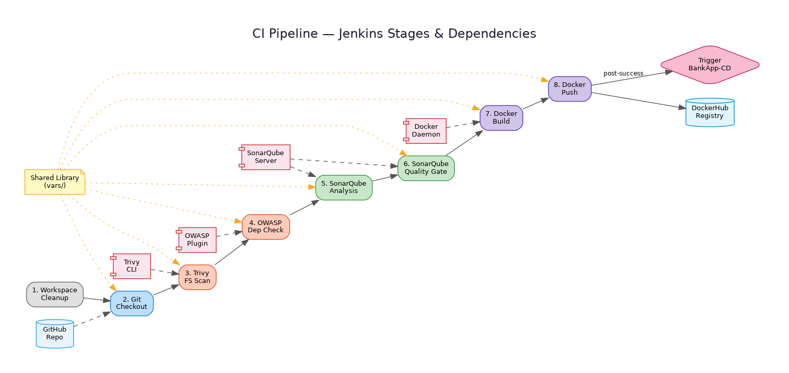
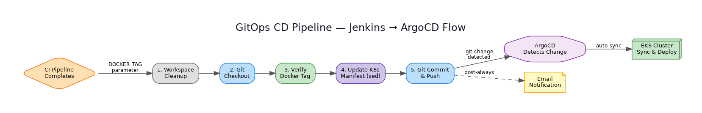
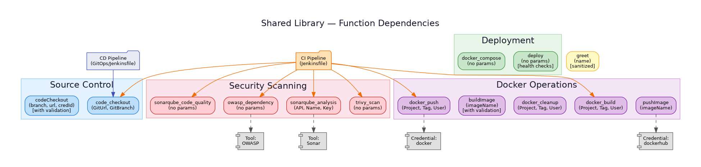

# BankApp Infrastructure Documentation

> Comprehensive documentation site for the Springboot-BankApp infrastructure, covering all deployment modules, dependency graphs, variable catalogs, and deployment runbooks.

## System Architecture

The BankApp is a Java Spring Boot banking application deployed on **AWS EKS** using a full DevSecOps pipeline. The infrastructure spans five modules:

| Module | Path | Purpose |
|--------|------|---------|
| [Kubernetes Manifests](../../kubernetes/README.md) | `kubernetes/` | Raw K8s YAML for direct `kubectl apply` or ArgoCD sync |
| [Helm Chart](../../helm/README.md) | `helm/bankapp/` | Templated K8s deployment with `values.yaml` customization |
| [CI Pipeline](../../Jenkinsfile) | `Jenkinsfile` | Jenkins CI — build, scan, containerize, push |
| [CD / GitOps Pipeline](../../GitOps/README.md) | `GitOps/Jenkinsfile` | Jenkins CD — update manifests and push for ArgoCD |
| [Shared Library](../../vars/README.md) | `vars/` | Reusable Groovy functions for Jenkins pipelines |

### Supporting Configuration

| File | Purpose |
|------|---------|
| [`Dockerfile`](../../Dockerfile) | Multi-stage build: Maven 3.8.3 + OpenJDK 17 builder, OpenJDK 17 Alpine runtime |
| [`docker-compose.yml`](../../docker-compose.yml) | Local development stack (MySQL + BankApp) |
| [`Ingress.md`](../../Ingress.md) | NGINX Ingress Controller setup guide |
| [`nginx.md`](../../nginx.md) | Nginx reverse proxy and SSL/HTTPS configuration |
| [`cicd.md`](../../cicd.md) | CI/CD workflow overview and Jenkins setup guide |

## Documentation Index

- **[Module Dependency Graphs](dependency-graphs.md)** — Visual diagrams showing how infrastructure components depend on each other
- **[Variable Catalog](variable-catalog.md)** — Complete reference of all configurable parameters across all modules
- **[Deployment Runbooks](deployment-runbooks.md)** — Step-by-step operational procedures for deploying, updating, and troubleshooting

## Quick Links

| Diagram | Description |
|---------|-------------|
|  | [Full System Architecture](diagrams/full-system-architecture.png) |
|  | [Kubernetes Module Dependencies](diagrams/kubernetes-module-deps.png) |
|  | [Helm Chart Dependencies](diagrams/helm-chart-deps.png) |
|  | [CI/CD Pipeline Flow](diagrams/cicd-pipeline-flow.png) |
|  | [GitOps Pipeline Flow](diagrams/gitops-pipeline-flow.png) |
|  | [Shared Library Dependencies](diagrams/shared-library-deps.png) |

## Technology Stack

| Category | Technology | Version / Notes |
|----------|-----------|-----------------|
| Language | Java | 17 (Docker build), 11 (app runtime) |
| Framework | Spring Boot | 2.7.18 |
| Database | MySQL | 8.0 |
| Container Runtime | Docker | Multi-stage Dockerfile |
| Container Registry | DockerHub | `trainwithshubham/bankapp-eks` |
| Orchestration | Kubernetes | EKS 1.30/1.31 |
| Package Manager | Helm | v3 |
| CI Server | Jenkins | With shared library |
| CD / GitOps | ArgoCD | Watches `kubernetes/` directory |
| Security Scanning | Trivy, OWASP Dependency-Check, SonarQube | Integrated in CI pipeline |
| Ingress | NGINX Ingress Controller | With cert-manager for TLS |
| TLS | Let's Encrypt | ACME HTTP-01 challenge |
| Monitoring | Prometheus + Grafana | via `kube-prometheus-stack` Helm chart |
| Cloud Provider | AWS | EKS, EC2 (t2.medium), us-west-1 |
