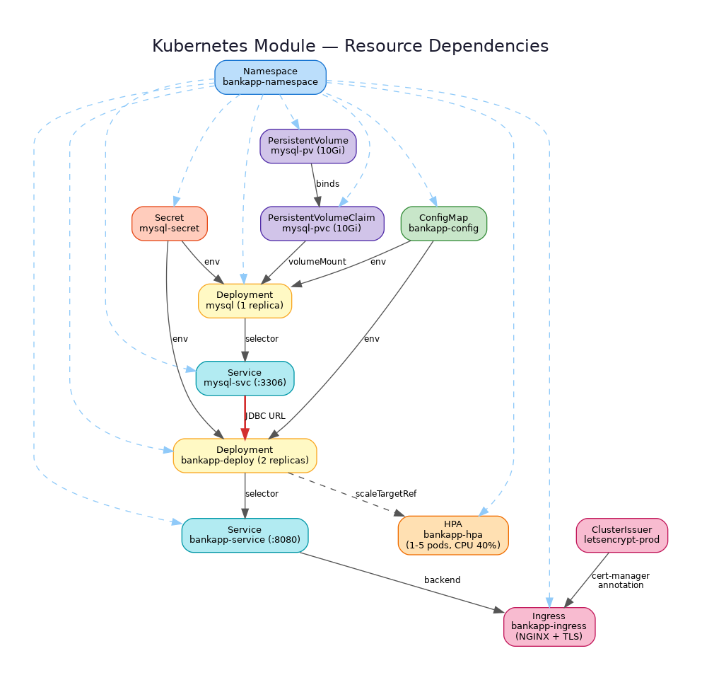

# Kubernetes Module — Raw Manifests

> Plain Kubernetes YAML manifests for deploying the BankApp stack on **AWS EKS**.

## Overview

This directory contains un-templated Kubernetes manifests that deploy a Spring Boot banking application backed by MySQL 8.0. The manifests target the `bankapp-namespace` namespace and are designed to be applied with `kubectl` or synced via ArgoCD.

## Architecture



| Layer | Resources |
|-------|-----------|
| **Namespace** | `bankapp-namespace` |
| **Data** | MySQL Deployment, PV, PVC, Secret, ConfigMap |
| **Application** | BankApp Deployment (2 replicas) |
| **Networking** | ClusterIP Service, NGINX Ingress with TLS |
| **Scaling** | HorizontalPodAutoscaler (CPU-based) |
| **TLS** | Let's Encrypt ClusterIssuer via cert-manager |

## Manifest Inventory

| File | Kind | Name | Description |
|------|------|------|-------------|
| `bankapp-namespace.yaml` | Namespace | `bankapp-namespace` | Isolated namespace for all BankApp resources |
| `secrets.yaml` | Secret | `mysql-secret` | MySQL root and Spring datasource passwords (base64) |
| `configmap.yaml` | ConfigMap | `bankapp-config` | Database URL, username, and database name |
| `persistent-volume.yaml` | PersistentVolume | `mysql-pv` | 10 Gi hostPath volume at `/mnt/data/mysql` |
| `persistent-volume-claim.yaml` | PersistentVolumeClaim | `mysql-pvc` | 10 Gi claim, `storageClassName: standard` |
| `mysql-deployment.yml` | Deployment | `mysql` | Single-replica MySQL 8.0 with PVC mount |
| `mysql-service.yaml` | Service | `mysql-svc` | ClusterIP service exposing MySQL on port 3306 |
| `bankapp-deployment.yml` | Deployment | `bankapp-deploy` | 2-replica Spring Boot app on port 8080 |
| `bankapp-service.yaml` | Service | `bankapp-service` | ClusterIP service exposing BankApp on port 8080 |
| `bankapp-ingress.yml` | Ingress | `bankapp-ingress` | NGINX Ingress with TLS via Let's Encrypt |
| `bankapp-hpa.yml` | HorizontalPodAutoscaler | `bankapp-hpa` | Scales 1–5 replicas at 40% CPU utilization |
| `letsencrypt-clusterissuer.yaml` | ClusterIssuer | `letsencrypt-prod` | ACME HTTP-01 solver for automated TLS certificates |

## Variable Catalog

### ConfigMap Values (`bankapp-config`)

| Key | Value | Description |
|-----|-------|-------------|
| `MYSQL_DATABASE` | `BankDB` | MySQL database name |
| `SPRING_DATASOURCE_URL` | `jdbc:mysql://mysql-svc.bankapp-namespace.svc.cluster.local:3306/BankDB?useSSL=false&allowPublicKeyRetrieval=true&serverTimezone=UTC` | JDBC connection string |
| `SPRING_DATASOURCE_USERNAME` | `root` | MySQL username |

### Secret Values (`mysql-secret`)

| Key | Encoding | Description |
|-----|----------|-------------|
| `MYSQL_ROOT_PASSWORD` | Base64 | MySQL root password |
| `SPRING_DATASOURCE_PASSWORD` | Base64 | Spring datasource password |

### Resource Limits

| Component | CPU Request | CPU Limit | Memory Request | Memory Limit |
|-----------|-------------|-----------|----------------|--------------|
| BankApp | 250m | 500m | 512 Mi | 1 Gi |
| MySQL | *(none set)* | *(none set)* | *(none set)* | *(none set)* |

### HPA Configuration

| Parameter | Value |
|-----------|-------|
| Min Replicas | 1 |
| Max Replicas | 5 |
| Target CPU Utilization | 40% |

### Ingress Configuration

| Parameter | Value |
|-----------|-------|
| Ingress Class | `nginx` |
| Host | `megaproject.trainwithshubham.com` |
| TLS Secret | `bankapp-tls-secret` |
| Cluster Issuer | `letsencrypt-prod` |
| SSL Redirect | `true` |
| Max Body Size | `50m` |

## Prerequisites

- AWS EKS cluster with `kubectl` configured
- NGINX Ingress Controller installed (`ingress-nginx` namespace)
- cert-manager installed for automated TLS
- Kubernetes Metrics Server installed (required for HPA)
- `storageClassName: standard` available in the cluster

## Apply Order

Resources must be applied in dependency order:

```bash
kubectl apply -f bankapp-namespace.yaml
kubectl apply -f secrets.yaml
kubectl apply -f configmap.yaml
kubectl apply -f persistent-volume.yaml
kubectl apply -f persistent-volume-claim.yaml
kubectl apply -f mysql-deployment.yml
kubectl apply -f mysql-service.yaml
kubectl apply -f bankapp-deployment.yml
kubectl apply -f bankapp-service.yaml
kubectl apply -f letsencrypt-clusterissuer.yaml
kubectl apply -f bankapp-ingress.yml
kubectl apply -f bankapp-hpa.yml
```

Or apply all at once (kubectl resolves dependencies):

```bash
kubectl apply -f .
```

## Verification

```bash
# Check all resources
kubectl get all -n bankapp-namespace

# Verify MySQL is running
kubectl get pods -n bankapp-namespace -l app=mysql

# Verify BankApp is running
kubectl get pods -n bankapp-namespace -l app=bankapp-deploy

# Check Ingress and TLS
kubectl get ingress -n bankapp-namespace
kubectl get certificate -n bankapp-namespace

# Check HPA status
kubectl get hpa -n bankapp-namespace
```
