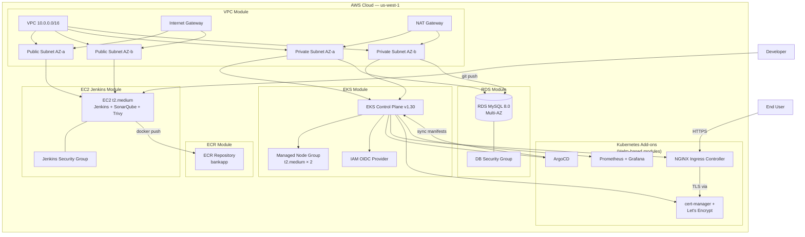
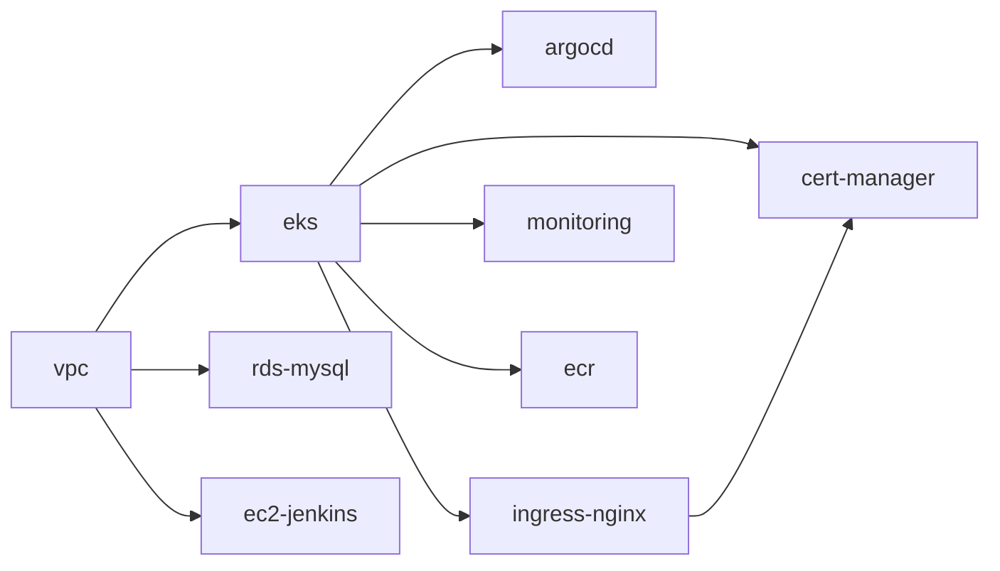

# Terraform Infrastructure — Springboot BankApp

This directory contains Terraform modules that codify the entire AWS infrastructure for the Springboot BankApp DevSecOps platform. The modules replace the manual `eksctl`, `kubectl`, and `helm` provisioning steps documented in the project README with declarative, version-controlled infrastructure as code.

## Architecture Overview



## Module Inventory

| Module | Purpose | Directory |
|--------|---------|-----------|
| [VPC](modules/vpc/README.md) | Networking foundation — VPC, subnets, NAT, IGW, route tables | `modules/vpc/` |
| [EKS](modules/eks/README.md) | Kubernetes control plane, managed node groups, IAM OIDC | `modules/eks/` |
| [RDS MySQL](modules/rds-mysql/README.md) | Production-grade managed MySQL database | `modules/rds-mysql/` |
| [EC2 Jenkins](modules/ec2-jenkins/README.md) | CI server with Jenkins, SonarQube, Trivy, Docker | `modules/ec2-jenkins/` |
| [ECR](modules/ecr/README.md) | Container image registry for the BankApp | `modules/ecr/` |
| [ArgoCD](modules/argocd/README.md) | GitOps continuous delivery controller | `modules/argocd/` |
| [Ingress NGINX](modules/ingress-nginx/README.md) | Kubernetes ingress controller with AWS NLB | `modules/ingress-nginx/` |
| [cert-manager](modules/cert-manager/README.md) | TLS certificate automation via Let's Encrypt | `modules/cert-manager/` |
| [Monitoring](modules/monitoring/README.md) | Prometheus, Grafana, and Alertmanager stack | `modules/monitoring/` |

## Module Dependency Graph



## Prerequisites

| Tool | Version | Purpose |
|------|---------|---------|
| Terraform | >= 1.5.0 | Infrastructure provisioning |
| AWS CLI | >= 2.x | AWS authentication |
| kubectl | >= 1.28 | Kubernetes management |
| Helm | >= 3.12 | Chart-based K8s installs |

## Quick Start

```hcl
# environments/dev/main.tf

module "vpc" {
  source       = "../../modules/vpc"
  project_name = "bankapp"
  environment  = "dev"
  vpc_cidr     = "10.0.0.0/16"
  azs          = ["us-west-1a", "us-west-1b"]
}

module "eks" {
  source            = "../../modules/eks"
  project_name      = "bankapp"
  environment       = "dev"
  vpc_id            = module.vpc.vpc_id
  private_subnet_ids = module.vpc.private_subnet_ids
  kubernetes_version = "1.30"
  node_instance_type = "t2.medium"
  node_desired_size  = 2
}

module "rds_mysql" {
  source             = "../../modules/rds-mysql"
  project_name       = "bankapp"
  environment        = "dev"
  vpc_id             = module.vpc.vpc_id
  private_subnet_ids = module.vpc.private_subnet_ids
  db_name            = "BankDB"
  db_username        = "root"
  eks_security_group_id = module.eks.node_security_group_id
}

module "ec2_jenkins" {
  source            = "../../modules/ec2-jenkins"
  project_name      = "bankapp"
  environment       = "dev"
  vpc_id            = module.vpc.vpc_id
  public_subnet_id  = module.vpc.public_subnet_ids[0]
  instance_type     = "t2.medium"
  ssh_key_name      = "eks-nodegroup-key"
}

module "ecr" {
  source       = "../../modules/ecr"
  project_name = "bankapp"
  environment  = "dev"
}

module "argocd" {
  source       = "../../modules/argocd"
  cluster_name = module.eks.cluster_name
  depends_on   = [module.eks]
}

module "ingress_nginx" {
  source       = "../../modules/ingress-nginx"
  cluster_name = module.eks.cluster_name
  depends_on   = [module.eks]
}

module "cert_manager" {
  source              = "../../modules/cert-manager"
  cluster_name        = module.eks.cluster_name
  letsencrypt_email   = "admin@example.com"
  ingress_class       = "nginx"
  depends_on          = [module.ingress_nginx]
}

module "monitoring" {
  source       = "../../modules/monitoring"
  cluster_name = module.eks.cluster_name
  depends_on   = [module.eks]
}
```

## State Management

Use an S3 backend with DynamoDB locking:

```hcl
terraform {
  backend "s3" {
    bucket         = "bankapp-terraform-state"
    key            = "dev/terraform.tfstate"
    region         = "us-west-1"
    dynamodb_table = "bankapp-terraform-lock"
    encrypt        = true
  }
}
```

## Environments

| Environment | Purpose | Sizing |
|-------------|---------|--------|
| `dev` | Development and testing | t2.medium nodes, single-AZ RDS |
| `staging` | Pre-production validation | t3.large nodes, Multi-AZ RDS |
| `prod` | Production workloads | t3.xlarge nodes, Multi-AZ RDS, HA |
