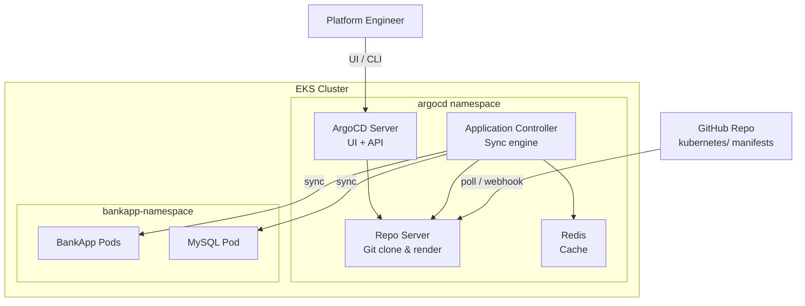
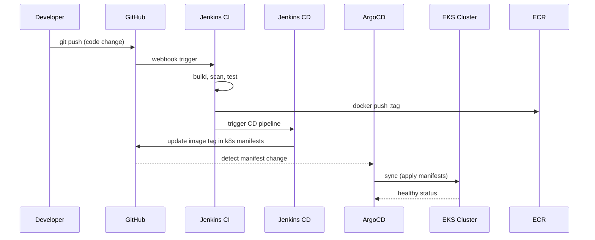

# ArgoCD Module

## Purpose

Installs ArgoCD on the EKS cluster via the Helm Terraform provider, replacing the manual `kubectl apply` installation from the project README. ArgoCD implements the GitOps continuous delivery pattern — it watches the `kubernetes/` manifests in the Git repository and automatically syncs them to the cluster, ensuring the deployed state always matches the Git source of truth.

## Architecture



## Inputs

| Name | Type | Default | Required | Description |
|------|------|---------|----------|-------------|
| `cluster_name` | `string` | — | yes | EKS cluster name (used to configure Helm provider) |
| `namespace` | `string` | `"argocd"` | no | Kubernetes namespace for ArgoCD installation |
| `chart_version` | `string` | `"5.51.6"` | no | ArgoCD Helm chart version |
| `server_service_type` | `string` | `"NodePort"` | no | Service type for the ArgoCD server (`ClusterIP`, `NodePort`, `LoadBalancer`) |
| `server_node_port` | `number` | `null` | no | Specific NodePort for the ArgoCD server (if service type is NodePort) |
| `enable_ha` | `bool` | `false` | no | Enable high-availability mode (3 replicas) |
| `admin_password_bcrypt` | `string` | `""` | no | Bcrypt-hashed admin password; if empty, auto-generated |
| `repositories` | `list(object)` | `[]` | no | List of Git repositories to register (URL, credentials) |
| `applications` | `list(object)` | `[]` | no | ArgoCD Application CRDs to create on install |
| `tags` | `map(string)` | `{}` | no | Additional tags for labeling |

## Outputs

| Name | Type | Description |
|------|------|-------------|
| `namespace` | `string` | Namespace where ArgoCD is installed |
| `server_service_name` | `string` | Kubernetes service name for the ArgoCD server |
| `initial_admin_secret_command` | `string` | `kubectl` command to retrieve the initial admin password |
| `server_url` | `string` | Internal cluster URL for the ArgoCD API server |

## Dependencies

- **Upstream**: `eks` — requires a running EKS cluster for the Helm provider.
- **Downstream**: None — ArgoCD manages application deployments independently via Git polling.

## Usage Example

```hcl
module "argocd" {
  source       = "../../modules/argocd"
  cluster_name = module.eks.cluster_name

  chart_version      = "5.51.6"
  server_service_type = "NodePort"

  repositories = [
    {
      name     = "bankapp"
      url      = "https://github.com/COG-GTM/Springboot-BankApp.git"
      username = ""       # public repo
      password = ""
    }
  ]

  applications = [
    {
      name             = "bankapp"
      repo_url         = "https://github.com/COG-GTM/Springboot-BankApp.git"
      path             = "kubernetes"
      target_revision  = "DevOps"
      destination_ns   = "bankapp-namespace"
      auto_sync        = true
      auto_create_ns   = true
    }
  ]

  depends_on = [module.eks]
}

# Retrieve initial admin password:
# $ kubectl -n argocd get secret argocd-initial-admin-secret -o jsonpath="{.data.password}" | base64 -d
```

## Key Design Decisions

- **Helm-based install**: Uses the official `argo/argo-cd` Helm chart for structured, upgradeable deployments instead of raw manifests.
- **NodePort default**: Matches the current manual setup (`kubectl patch svc argocd-server -p '{"spec": {"type": "NodePort"}}'`). Switch to `LoadBalancer` or use the Ingress module for production.
- **Application CRDs**: Optionally pre-creates the BankApp ArgoCD Application resource, automating the manual "New App" UI step.
- **Repository registration**: Pre-registers the Git repository so ArgoCD can immediately begin syncing.

## GitOps Workflow


