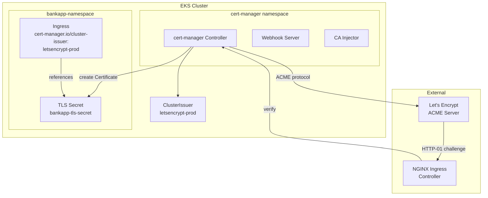
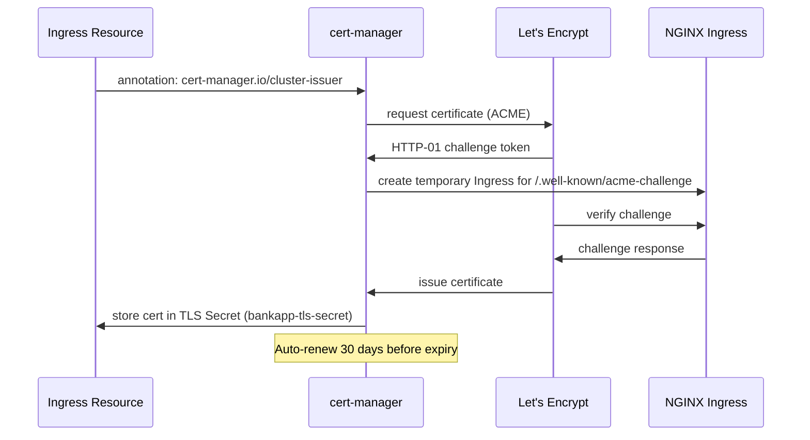

# cert-manager Module

## Purpose

Installs cert-manager on the EKS cluster and configures a Let's Encrypt ClusterIssuer for automated TLS certificate provisioning. This module replaces the manual `letsencrypt-clusterissuer.yaml` manifest and automates the entire certificate lifecycle — issuance, renewal, and rotation — for Ingress resources. The BankApp Ingress references `cert-manager.io/cluster-issuer: letsencrypt-prod` to automatically obtain and renew TLS certificates.

## Architecture



## Inputs

| Name | Type | Default | Required | Description |
|------|------|---------|----------|-------------|
| `cluster_name` | `string` | — | yes | EKS cluster name (used to configure the Helm provider) |
| `namespace` | `string` | `"cert-manager"` | no | Kubernetes namespace for cert-manager |
| `chart_version` | `string` | `"v1.14.0"` | no | cert-manager Helm chart version |
| `letsencrypt_email` | `string` | — | yes | Email address for Let's Encrypt registration and expiry notifications |
| `letsencrypt_server` | `string` | `"https://acme-v02.api.letsencrypt.org/directory"` | no | ACME server URL (use staging for testing) |
| `ingress_class` | `string` | `"nginx"` | no | IngressClass used for HTTP-01 challenge solving |
| `cluster_issuer_name` | `string` | `"letsencrypt-prod"` | no | Name of the ClusterIssuer resource |
| `install_crds` | `bool` | `true` | no | Install cert-manager CRDs via Helm |
| `tags` | `map(string)` | `{}` | no | Additional tags for labeling |

## Outputs

| Name | Type | Description |
|------|------|-------------|
| `namespace` | `string` | Namespace where cert-manager is installed |
| `cluster_issuer_name` | `string` | Name of the created ClusterIssuer |
| `letsencrypt_server` | `string` | ACME server URL in use |

## Dependencies

- **Upstream**: `eks` (running cluster), `ingress-nginx` (HTTP-01 challenges require the NGINX Ingress Controller to serve ACME verification tokens).
- **Downstream**: BankApp's `bankapp-ingress.yml` references the ClusterIssuer via annotation.

## Usage Example

```hcl
module "cert_manager" {
  source       = "../../modules/cert-manager"
  cluster_name = module.eks.cluster_name

  chart_version     = "v1.14.0"
  letsencrypt_email = "admin@example.com"
  ingress_class     = "nginx"

  # Use staging for initial testing to avoid rate limits
  # letsencrypt_server = "https://acme-staging-v02.api.letsencrypt.org/directory"

  depends_on = [module.ingress_nginx]
}
```

## Certificate Flow



## Key Design Decisions

- **HTTP-01 solver**: Uses the NGINX Ingress Controller for ACME challenges, matching the existing `letsencrypt-clusterissuer.yaml` configuration (`class: nginx`).
- **CRDs via Helm**: Installs cert-manager CRDs as part of the Helm release for simplified management.
- **Production ACME server**: Defaults to the production Let's Encrypt endpoint; use the staging endpoint during initial setup to avoid rate limits.
- **ClusterIssuer**: Cluster-scoped rather than namespace-scoped, allowing any namespace's Ingress to request certificates.

## Staging vs Production

| Server | URL | Rate Limits | Trust |
|--------|-----|-------------|-------|
| Staging | `acme-staging-v02.api.letsencrypt.org` | Generous | Untrusted (for testing) |
| Production | `acme-v02.api.letsencrypt.org` | 50 certs/domain/week | Trusted |
