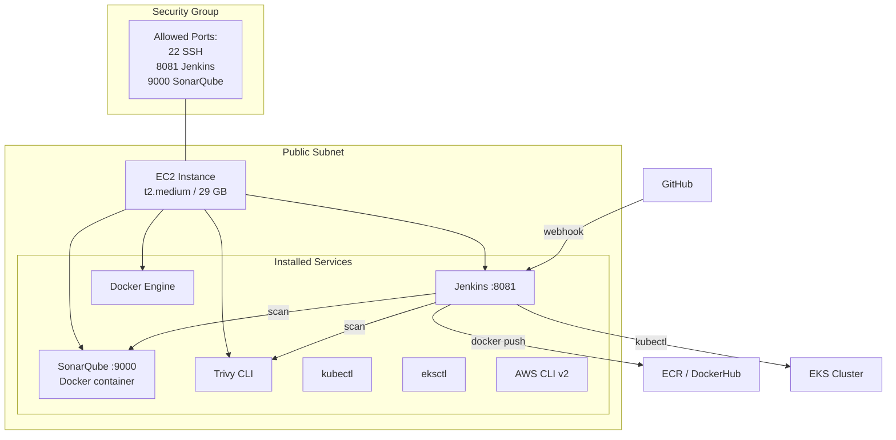

# EC2 Jenkins Module

## Purpose

Provisions an EC2 instance pre-configured as a Jenkins CI server with Docker, SonarQube, and Trivy installed. This module codifies the manual "Master machine" setup from the project README into repeatable infrastructure. The instance runs the BankApp CI pipeline (Jenkinsfile) which performs code checkout, security scanning (OWASP, Trivy), static analysis (SonarQube), and Docker image build/push.

## Architecture



## Inputs

| Name | Type | Default | Required | Description |
|------|------|---------|----------|-------------|
| `project_name` | `string` | — | yes | Project identifier for resource naming |
| `environment` | `string` | — | yes | Environment name (`dev`, `staging`, `prod`) |
| `vpc_id` | `string` | — | yes | VPC ID from the VPC module |
| `public_subnet_id` | `string` | — | yes | Public subnet ID for the EC2 instance |
| `instance_type` | `string` | `"t2.medium"` | no | EC2 instance type |
| `volume_size` | `number` | `29` | no | Root EBS volume size in GB |
| `ssh_key_name` | `string` | — | yes | SSH key pair name for instance access |
| `allowed_ssh_cidrs` | `list(string)` | `["0.0.0.0/0"]` | no | CIDR blocks allowed SSH access |
| `allowed_jenkins_cidrs` | `list(string)` | `["0.0.0.0/0"]` | no | CIDR blocks allowed access to Jenkins (port 8081) |
| `jenkins_admin_password` | `string` | — | no | Initial Jenkins admin password (if empty, uses auto-generated) |
| `sonarqube_enabled` | `bool` | `true` | no | Whether to run SonarQube as a Docker container |
| `ami_id` | `string` | `""` | no | Specific AMI ID; if empty, uses latest Ubuntu 22.04 |
| `tags` | `map(string)` | `{}` | no | Additional tags applied to all resources |

## Outputs

| Name | Type | Description |
|------|------|-------------|
| `instance_id` | `string` | EC2 instance ID |
| `public_ip` | `string` | Public IP of the Jenkins instance |
| `public_dns` | `string` | Public DNS hostname |
| `jenkins_url` | `string` | Full Jenkins URL (`http://<public_ip>:8081`) |
| `sonarqube_url` | `string` | Full SonarQube URL (`http://<public_ip>:9000`) |
| `security_group_id` | `string` | Security group ID of the instance |

## Dependencies

- **Upstream**: `vpc` — requires `vpc_id` and `public_subnet_id`.
- **Downstream**: Interacts with `eks` (kubectl access), `ecr` (docker push), but no Terraform-level dependency.

## Usage Example

```hcl
module "ec2_jenkins" {
  source           = "../../modules/ec2-jenkins"
  project_name     = "bankapp"
  environment      = "dev"
  vpc_id           = module.vpc.vpc_id
  public_subnet_id = module.vpc.public_subnet_ids[0]
  instance_type    = "t2.medium"
  volume_size      = 29
  ssh_key_name     = "eks-nodegroup-key"

  allowed_ssh_cidrs     = ["203.0.113.0/24"]  # restrict to your IP range
  allowed_jenkins_cidrs = ["0.0.0.0/0"]

  tags = {
    Role = "ci-server"
  }
}

output "jenkins_url" {
  value = module.ec2_jenkins.jenkins_url
}
```

## User Data Bootstrap

The module uses a `cloud-init` user data script to install:

1. **Java 17** (OpenJDK) — Jenkins runtime
2. **Jenkins** — from the official Debian repository, configured on port 8081
3. **Docker** — for building and pushing container images
4. **SonarQube** — run as a Docker container on port 9000
5. **Trivy** — filesystem and container image scanner
6. **AWS CLI v2** — for ECR authentication and EKS kubeconfig
7. **kubectl** — for Kubernetes manifest management
8. **eksctl** — for EKS cluster operations

## Key Design Decisions

- **Port 8081 for Jenkins**: Avoids conflict with BankApp's port 8080 during local testing.
- **SonarQube as Docker container**: Matches the current manual setup (`docker run sonarqube:lts-community`).
- **Public subnet placement**: Jenkins needs inbound webhook access from GitHub and outbound access to DockerHub/ECR.
- **Security group**: SSH and Jenkins ports are configurable via CIDR allow-lists; production deployments should restrict to known IPs.

## Security Considerations

- Store Jenkins admin password and SonarQube token in AWS Secrets Manager.
- Use an IAM instance profile with scoped permissions (ECR push, EKS describe, S3 artifact access).
- Enable automatic security updates via `unattended-upgrades`.
