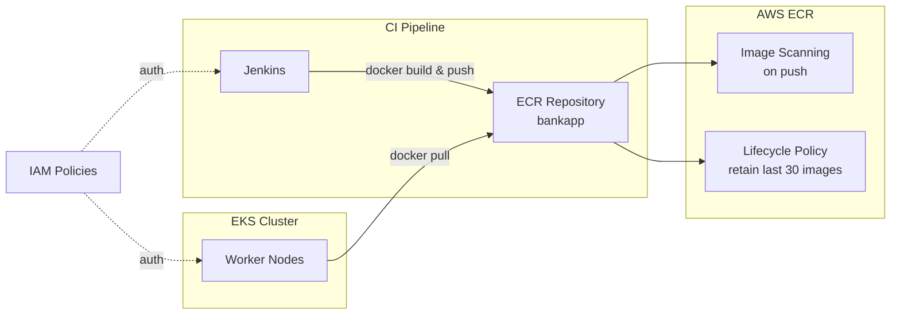

# ECR Module

## Purpose

Provisions an Amazon Elastic Container Registry (ECR) repository for storing Docker images of the BankApp. Replaces DockerHub as the container registry with a private, AWS-native registry that integrates with IAM for authentication and provides vulnerability scanning. The CI pipeline pushes built images here, and EKS pulls them for deployment.

## Architecture



## Inputs

| Name | Type | Default | Required | Description |
|------|------|---------|----------|-------------|
| `project_name` | `string` | — | yes | Project identifier used in the repository name |
| `environment` | `string` | — | yes | Environment name (`dev`, `staging`, `prod`) |
| `image_tag_mutability` | `string` | `"MUTABLE"` | no | Tag mutability setting (`MUTABLE` or `IMMUTABLE`) |
| `scan_on_push` | `bool` | `true` | no | Enable automatic vulnerability scanning on image push |
| `lifecycle_max_image_count` | `number` | `30` | no | Maximum number of images to retain (oldest untagged are expired) |
| `force_delete` | `bool` | `false` | no | Allow deletion of the repository even if it contains images |
| `encryption_type` | `string` | `"AES256"` | no | Encryption type (`AES256` or `KMS`) |
| `tags` | `map(string)` | `{}` | no | Additional tags applied to all resources |

## Outputs

| Name | Type | Description |
|------|------|-------------|
| `repository_url` | `string` | Full ECR repository URL (e.g. `123456789.dkr.ecr.us-west-1.amazonaws.com/bankapp-dev`) |
| `repository_arn` | `string` | ARN of the ECR repository |
| `registry_id` | `string` | AWS account ID for the ECR registry |
| `docker_login_command` | `string` | AWS CLI command to authenticate Docker to ECR |

## Dependencies

- **Upstream**: None — standalone AWS resource.
- **Downstream**: `ec2-jenkins` (push destination), `eks` (pull source via `AmazonEC2ContainerRegistryReadOnly` policy on node role).

## Usage Example

```hcl
module "ecr" {
  source       = "../../modules/ecr"
  project_name = "bankapp"
  environment  = "dev"

  scan_on_push              = true
  lifecycle_max_image_count = 30
  image_tag_mutability      = "MUTABLE"

  tags = {
    Team = "platform"
  }
}

# Authenticate Docker to ECR:
# $ aws ecr get-login-password --region us-west-1 | docker login --username AWS --password-stdin <repository_url>
```

## Key Design Decisions

- **Scan on push**: Every image is scanned for CVEs before deployment, aligning with the DevSecOps pipeline (Trivy + ECR native scanning).
- **Lifecycle policy**: Prevents unbounded storage costs by expiring old untagged images beyond the retention count.
- **Mutable tags**: Default allows overwriting `latest` tag; set to `IMMUTABLE` for production to enforce unique tags per build.
- **AES256 encryption**: Default server-side encryption; upgrade to KMS for compliance-driven environments.
