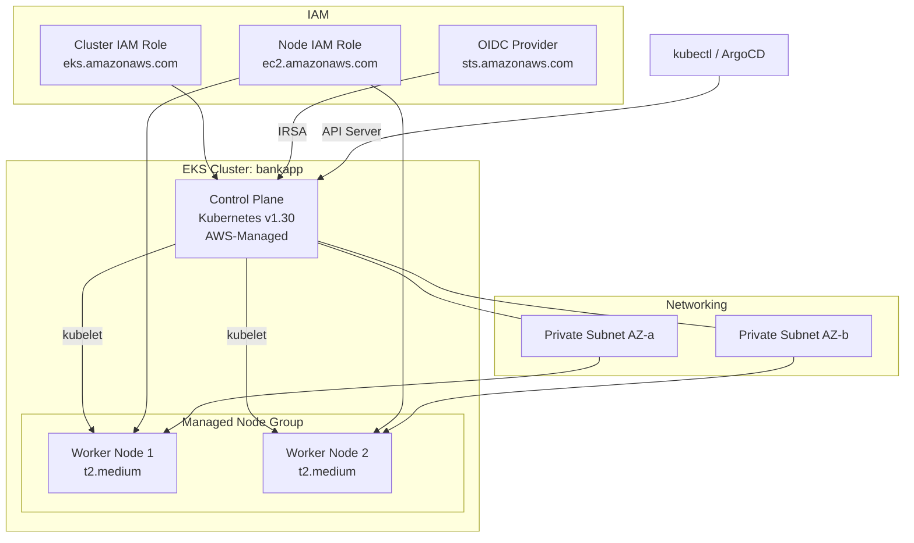

# EKS Module

## Purpose

Provisions an Amazon EKS (Elastic Kubernetes Service) cluster with managed node groups, IAM OIDC provider for service account integration, and the required IAM roles and policies. This module replaces the manual `eksctl create cluster` and `eksctl create nodegroup` commands from the project README with declarative Terraform.

## Architecture



## Inputs

| Name | Type | Default | Required | Description |
|------|------|---------|----------|-------------|
| `project_name` | `string` | — | yes | Project identifier for resource naming |
| `environment` | `string` | — | yes | Environment name (`dev`, `staging`, `prod`) |
| `vpc_id` | `string` | — | yes | VPC ID from the VPC module |
| `private_subnet_ids` | `list(string)` | — | yes | Private subnet IDs for worker nodes |
| `kubernetes_version` | `string` | `"1.30"` | no | Kubernetes version for the EKS cluster |
| `node_instance_type` | `string` | `"t2.medium"` | no | EC2 instance type for worker nodes |
| `node_desired_size` | `number` | `2` | no | Desired number of worker nodes |
| `node_min_size` | `number` | `2` | no | Minimum number of worker nodes |
| `node_max_size` | `number` | `5` | no | Maximum number of worker nodes |
| `node_disk_size` | `number` | `29` | no | EBS volume size (GB) for each worker node |
| `ssh_key_name` | `string` | `"eks-nodegroup-key"` | no | EC2 SSH key pair name for node access |
| `enable_cluster_logging` | `list(string)` | `["api", "audit"]` | no | EKS control plane log types to enable |
| `tags` | `map(string)` | `{}` | no | Additional tags applied to all resources |

## Outputs

| Name | Type | Description |
|------|------|-------------|
| `cluster_name` | `string` | Name of the EKS cluster |
| `cluster_endpoint` | `string` | API server endpoint URL |
| `cluster_certificate_authority` | `string` | Base64-encoded CA certificate for the cluster |
| `cluster_security_group_id` | `string` | Security group ID for the EKS cluster |
| `node_security_group_id` | `string` | Security group ID for the worker nodes |
| `oidc_provider_arn` | `string` | ARN of the IAM OIDC provider |
| `oidc_provider_url` | `string` | Issuer URL of the OIDC provider |
| `node_role_arn` | `string` | ARN of the IAM role assigned to worker nodes |
| `kubeconfig_command` | `string` | AWS CLI command to update local kubeconfig |

## Dependencies

- **Upstream**: `vpc` — requires `vpc_id` and `private_subnet_ids`.
- **Downstream**: `argocd`, `ingress-nginx`, `cert-manager`, `monitoring` all require `cluster_name` and connect via the Helm/Kubernetes Terraform provider.

## Usage Example

```hcl
module "eks" {
  source             = "../../modules/eks"
  project_name       = "bankapp"
  environment        = "dev"
  vpc_id             = module.vpc.vpc_id
  private_subnet_ids = module.vpc.private_subnet_ids
  kubernetes_version = "1.30"
  node_instance_type = "t2.medium"
  node_desired_size  = 2
  node_max_size      = 5
  node_disk_size     = 29
  ssh_key_name       = "eks-nodegroup-key"
}

# Configure kubectl after apply
# $ aws eks update-kubeconfig --name bankapp-dev --region us-west-1
```

## Key Design Decisions

- **Managed node groups**: Preferred over self-managed nodes for automatic AMI patching and simplified lifecycle management.
- **IAM OIDC provider**: Enables IAM Roles for Service Accounts (IRSA), required by cert-manager, the AWS Load Balancer Controller, and other add-ons.
- **Private-only nodes**: Worker nodes run exclusively in private subnets for security; API server is public with optional IP whitelisting.
- **Cluster logging**: API server and audit logs are shipped to CloudWatch for compliance.

## IAM Policies Attached to Node Role

| Policy | Purpose |
|--------|---------|
| `AmazonEKSWorkerNodePolicy` | Base EKS worker permissions |
| `AmazonEKS_CNI_Policy` | VPC CNI networking for pod IPs |
| `AmazonEC2ContainerRegistryReadOnly` | Pull images from ECR |
| `AmazonSSMManagedInstanceCore` | SSM access for node troubleshooting |
