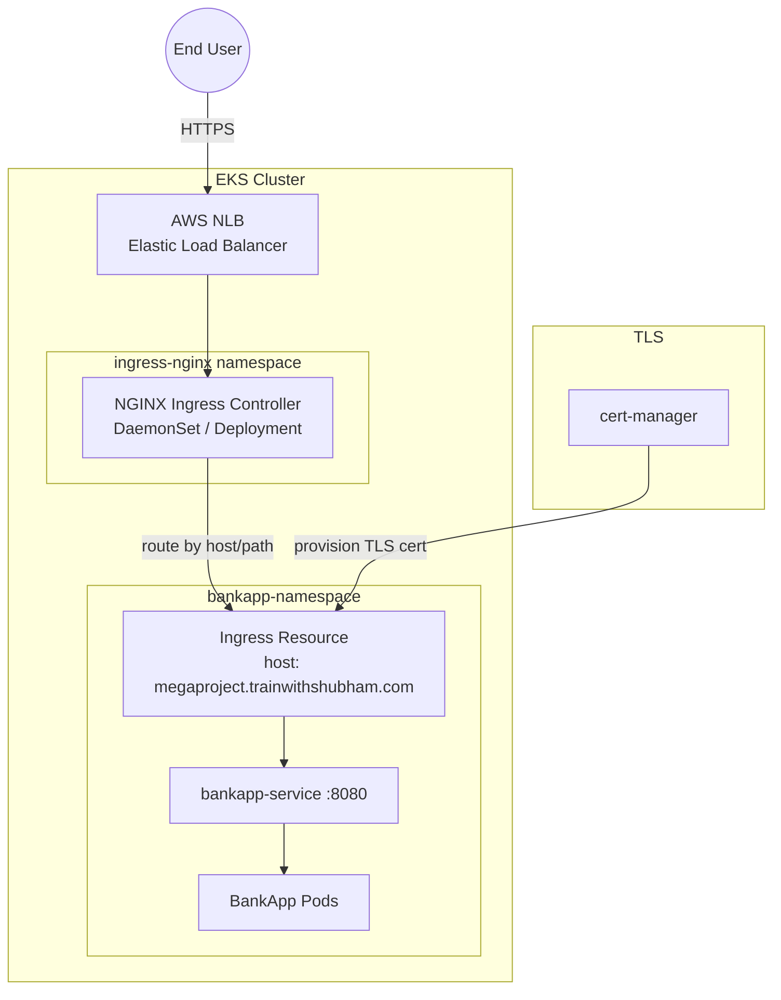

# Ingress NGINX Module

## Purpose

Installs the NGINX Ingress Controller on the EKS cluster via Helm, providing a Kubernetes-native reverse proxy that routes external HTTP/HTTPS traffic to internal services. This module replaces the manual `kubectl apply` of the NGINX ingress manifests and the `helm upgrade --install ingress-nginx` command from the project README. The controller creates an AWS Network Load Balancer (NLB) to receive traffic and routes it to the BankApp based on Ingress rules.

## Architecture



## Inputs

| Name | Type | Default | Required | Description |
|------|------|---------|----------|-------------|
| `cluster_name` | `string` | — | yes | EKS cluster name (used to configure the Helm provider) |
| `namespace` | `string` | `"ingress-nginx"` | no | Kubernetes namespace for the Ingress Controller |
| `chart_version` | `string` | `"4.9.0"` | no | NGINX Ingress Controller Helm chart version |
| `service_type` | `string` | `"LoadBalancer"` | no | Service type for the controller (`LoadBalancer`, `NodePort`) |
| `replica_count` | `number` | `2` | no | Number of Ingress Controller replicas |
| `enable_metrics` | `bool` | `true` | no | Expose Prometheus metrics endpoint |
| `proxy_body_size` | `string` | `"50m"` | no | Maximum allowed size of the client request body |
| `ssl_redirect` | `bool` | `true` | no | Force HTTPS redirect for all HTTP requests |
| `load_balancer_annotations` | `map(string)` | `{}` | no | Additional annotations for the NLB service (e.g. ACM cert ARN) |
| `tags` | `map(string)` | `{}` | no | Additional tags for labeling |

## Outputs

| Name | Type | Description |
|------|------|-------------|
| `namespace` | `string` | Namespace where the Ingress Controller is installed |
| `controller_service_name` | `string` | Kubernetes service name of the controller |
| `load_balancer_hostname` | `string` | DNS hostname of the provisioned AWS NLB |
| `ingress_class_name` | `string` | IngressClass name to use in Ingress resources (default: `nginx`) |

## Dependencies

- **Upstream**: `eks` — requires a running EKS cluster.
- **Downstream**: `cert-manager` — relies on the Ingress Controller's IngressClass for HTTP-01 challenge solving. BankApp's `bankapp-ingress.yml` references `ingressClassName: nginx`.

## Usage Example

```hcl
module "ingress_nginx" {
  source       = "../../modules/ingress-nginx"
  cluster_name = module.eks.cluster_name

  chart_version  = "4.9.0"
  service_type   = "LoadBalancer"
  replica_count  = 2
  ssl_redirect   = true
  proxy_body_size = "50m"

  load_balancer_annotations = {
    "service.beta.kubernetes.io/aws-load-balancer-type"   = "nlb"
    "service.beta.kubernetes.io/aws-load-balancer-scheme" = "internet-facing"
  }

  depends_on = [module.eks]
}

# After apply, point your DNS to:
# $ kubectl get svc -n ingress-nginx ingress-nginx-controller -o jsonpath='{.status.loadBalancer.ingress[0].hostname}'
```

## Key Design Decisions

- **Helm-based install**: Uses the official `ingress-nginx/ingress-nginx` chart for maintainability and upgrade support.
- **AWS NLB**: Network Load Balancer is preferred over Classic ALB for Layer 4 TCP pass-through with TLS termination at the NGINX pod level.
- **SSL redirect**: Enforced by default, matching the existing `bankapp-ingress.yml` annotation `nginx.ingress.kubernetes.io/ssl-redirect: "true"`.
- **Metrics**: Enabled by default for integration with the Monitoring module (Prometheus scraping).

## DNS Configuration

After the NLB is provisioned, create a DNS record pointing to the load balancer:

```
megaproject.trainwithshubham.com  →  CNAME  →  <NLB hostname>
```

Or use an AWS Route 53 Alias record for the NLB.
