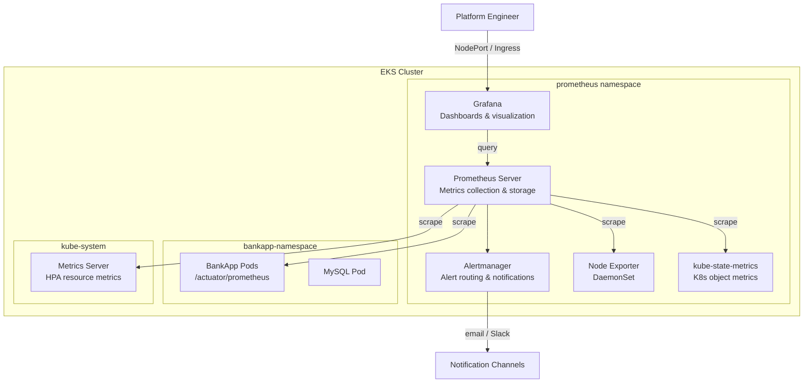

# Monitoring Module

## Purpose

Installs the `kube-prometheus-stack` Helm chart on the EKS cluster, providing a complete monitoring and alerting stack with Prometheus, Grafana, and Alertmanager. This module replaces the manual Helm install commands from the project README and configures the stack for production-grade observability of both the EKS cluster infrastructure and the BankApp workloads.

## Architecture



## Inputs

| Name | Type | Default | Required | Description |
|------|------|---------|----------|-------------|
| `cluster_name` | `string` | — | yes | EKS cluster name (used to configure the Helm provider) |
| `namespace` | `string` | `"prometheus"` | no | Kubernetes namespace for the monitoring stack |
| `chart_version` | `string` | `"56.0.0"` | no | `kube-prometheus-stack` Helm chart version |
| `grafana_service_type` | `string` | `"NodePort"` | no | Service type for Grafana (`ClusterIP`, `NodePort`, `LoadBalancer`) |
| `grafana_node_port` | `number` | `null` | no | Specific NodePort for Grafana (if service type is NodePort) |
| `prometheus_service_type` | `string` | `"NodePort"` | no | Service type for Prometheus server |
| `prometheus_retention` | `string` | `"15d"` | no | Prometheus data retention period |
| `prometheus_storage_size` | `string` | `"50Gi"` | no | Persistent volume size for Prometheus data |
| `grafana_admin_password` | `string` | `""` | no | Grafana admin password; if empty, auto-generated (stored in K8s secret) |
| `enable_alertmanager` | `bool` | `true` | no | Enable Alertmanager deployment |
| `additional_scrape_configs` | `string` | `""` | no | Additional Prometheus scrape configurations (YAML string) |
| `install_metrics_server` | `bool` | `true` | no | Install Kubernetes Metrics Server for HPA support |
| `tags` | `map(string)` | `{}` | no | Additional tags for labeling |

## Outputs

| Name | Type | Description |
|------|------|-------------|
| `namespace` | `string` | Namespace where monitoring is installed |
| `grafana_service_name` | `string` | Kubernetes service name for Grafana |
| `grafana_url` | `string` | Access URL for Grafana (depends on service type) |
| `prometheus_service_name` | `string` | Kubernetes service name for Prometheus |
| `grafana_admin_password_command` | `string` | `kubectl` command to retrieve the Grafana admin password |
| `alertmanager_service_name` | `string` | Kubernetes service name for Alertmanager |

## Dependencies

- **Upstream**: `eks` — requires a running EKS cluster for the Helm provider.
- **Downstream**: None — monitoring is a leaf module. Optionally integrates with `ingress-nginx` if Grafana is exposed via Ingress.

## Usage Example

```hcl
module "monitoring" {
  source       = "../../modules/monitoring"
  cluster_name = module.eks.cluster_name

  chart_version          = "56.0.0"
  namespace              = "prometheus"
  grafana_service_type   = "NodePort"
  prometheus_retention   = "15d"
  prometheus_storage_size = "50Gi"

  install_metrics_server = true

  depends_on = [module.eks]
}

# Retrieve Grafana admin password:
# $ kubectl get secret -n prometheus stable-grafana -o jsonpath="{.data.admin-password}" | base64 -d
```

## Pre-built Dashboards

The `kube-prometheus-stack` chart ships with dashboards for:

| Dashboard | ID | Description |
|-----------|----|-------------|
| Kubernetes / Compute Resources / Cluster | 3119 | Cluster-wide CPU, memory, network |
| Kubernetes / Compute Resources / Namespace (Pods) | 12740 | Per-namespace pod resource usage |
| Node Exporter Full | 1860 | Detailed node-level metrics |
| CoreDNS | 15762 | DNS query rates and latency |

Custom BankApp dashboards can be added via Grafana's dashboard import or as ConfigMap sidecar dashboards.

## Key Design Decisions

- **kube-prometheus-stack**: Bundles Prometheus, Grafana, Alertmanager, node-exporter, and kube-state-metrics in a single coordinated install.
- **NodePort for Grafana**: Matches the current manual setup (`kubectl edit svc stable-grafana`). Use `LoadBalancer` or Ingress for production.
- **Metrics Server**: Installed alongside for HPA support, as referenced in the `bankapp-hpa.yml` manifest.
- **Persistent storage**: Prometheus data is stored on a PVC to survive pod restarts; retention is configurable.

## Alerting Configuration

Configure Alertmanager to send notifications:

```yaml
# Example: Slack alerting
alertmanager:
  config:
    receivers:
      - name: 'slack'
        slack_configs:
          - api_url: 'https://hooks.slack.com/services/...'
            channel: '#alerts'
    route:
      receiver: 'slack'
      group_by: ['alertname', 'namespace']
```

## Metrics Server Note

The Metrics Server requires the following args for EKS compatibility (handled by the module):

```yaml
args:
  - --kubelet-insecure-tls
  - --kubelet-preferred-address-types=InternalIP,Hostname,ExternalIP
```

This matches the manual configuration documented in `helm/README.md`.
