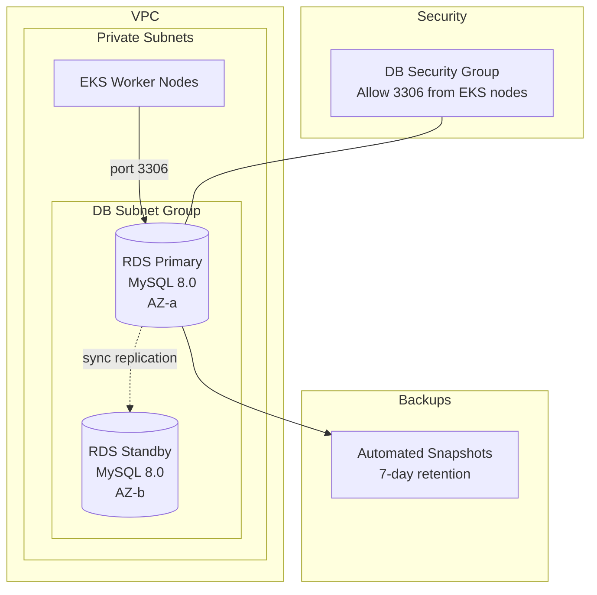

# RDS MySQL Module

## Purpose

Provisions a managed Amazon RDS MySQL 8.0 instance as a production-grade replacement for the in-cluster MySQL deployment. RDS provides automated backups, Multi-AZ failover, patching, and monitoring — eliminating the operational burden of running a stateful database inside Kubernetes. The BankApp Spring Boot application connects via the JDBC URL exposed as a Kubernetes secret.

## Architecture



## Inputs

| Name | Type | Default | Required | Description |
|------|------|---------|----------|-------------|
| `project_name` | `string` | — | yes | Project identifier for resource naming |
| `environment` | `string` | — | yes | Environment name (`dev`, `staging`, `prod`) |
| `vpc_id` | `string` | — | yes | VPC ID from the VPC module |
| `private_subnet_ids` | `list(string)` | — | yes | Private subnet IDs for the DB subnet group |
| `db_name` | `string` | `"BankDB"` | no | Name of the initial database to create |
| `db_username` | `string` | `"root"` | no | Master database username |
| `db_password` | `string` | — | yes | Master database password (use `sensitive = true`) |
| `instance_class` | `string` | `"db.t3.medium"` | no | RDS instance class |
| `allocated_storage` | `number` | `20` | no | Initial storage allocation in GB |
| `max_allocated_storage` | `number` | `100` | no | Maximum storage for autoscaling |
| `engine_version` | `string` | `"8.0"` | no | MySQL engine version |
| `multi_az` | `bool` | `false` | no | Enable Multi-AZ deployment for HA |
| `backup_retention_period` | `number` | `7` | no | Number of days to retain automated backups |
| `deletion_protection` | `bool` | `true` | no | Prevent accidental deletion of the DB instance |
| `eks_security_group_id` | `string` | — | yes | EKS node security group ID allowed to connect |
| `tags` | `map(string)` | `{}` | no | Additional tags applied to all resources |

## Outputs

| Name | Type | Description |
|------|------|-------------|
| `db_endpoint` | `string` | RDS endpoint hostname (e.g. `bankapp-dev.xxxx.us-west-1.rds.amazonaws.com`) |
| `db_port` | `number` | Database port (3306) |
| `db_name` | `string` | Name of the created database |
| `db_instance_id` | `string` | RDS instance identifier |
| `db_security_group_id` | `string` | Security group ID of the RDS instance |
| `jdbc_url` | `string` | Full JDBC connection URL for Spring Boot |

## Dependencies

- **Upstream**: `vpc` (subnet IDs, VPC ID), `eks` (node security group ID for ingress rules).
- **Downstream**: The BankApp Kubernetes deployment consumes `jdbc_url` via a ConfigMap or external secret.

## Usage Example

```hcl
module "rds_mysql" {
  source              = "../../modules/rds-mysql"
  project_name        = "bankapp"
  environment         = "dev"
  vpc_id              = module.vpc.vpc_id
  private_subnet_ids  = module.vpc.private_subnet_ids
  db_name             = "BankDB"
  db_username         = "root"
  db_password         = var.db_password  # from tfvars or secrets manager
  instance_class      = "db.t3.medium"
  multi_az            = false            # enable for staging/prod
  eks_security_group_id = module.eks.node_security_group_id

  tags = {
    DataClassification = "confidential"
  }
}

# JDBC URL output example:
# jdbc:mysql://bankapp-dev.xxxx.us-west-1.rds.amazonaws.com:3306/BankDB?useSSL=false&allowPublicKeyRetrieval=true&serverTimezone=UTC
```

## Key Design Decisions

- **RDS over in-cluster MySQL**: Offloads backup, patching, and failover to AWS; the existing `mysql-deployment.yml` can be retired for production.
- **Security group scoping**: Only EKS worker nodes can reach port 3306 — no public access.
- **Storage autoscaling**: Prevents downtime from disk exhaustion by scaling up to `max_allocated_storage`.
- **Deletion protection**: Enabled by default to prevent accidental data loss via `terraform destroy`.

## Migration from In-Cluster MySQL

To migrate from the existing Kubernetes MySQL deployment to RDS:

1. Apply this module to create the RDS instance.
2. Use `mysqldump` to export data from the in-cluster MySQL pod.
3. Import into the RDS instance.
4. Update the `bankapp-config` ConfigMap `SPRING_DATASOURCE_URL` to the `jdbc_url` output.
5. Restart the BankApp deployment to pick up the new connection string.
6. Decommission the in-cluster MySQL deployment, PV, and PVC.
