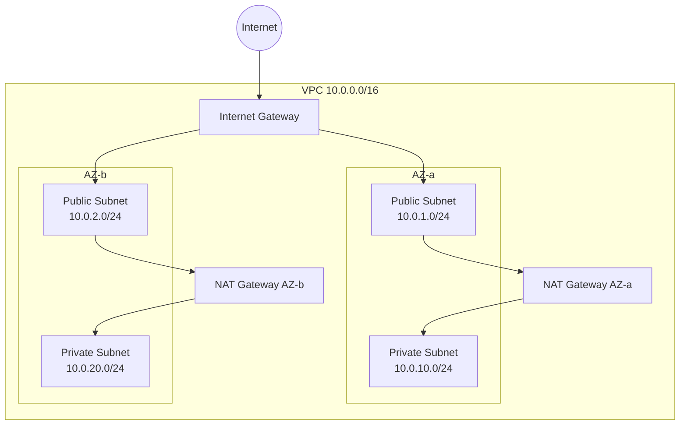

# VPC Module

## Purpose

Provisions the foundational AWS networking layer for the BankApp platform. Creates an isolated Virtual Private Cloud with public and private subnets across multiple Availability Zones, an Internet Gateway for public traffic, and NAT Gateways for outbound connectivity from private subnets. This module underpins every other module in the stack.

## Architecture



## Inputs

| Name | Type | Default | Required | Description |
|------|------|---------|----------|-------------|
| `project_name` | `string` | — | yes | Project identifier used in resource naming and tags |
| `environment` | `string` | — | yes | Environment name (`dev`, `staging`, `prod`) |
| `vpc_cidr` | `string` | `"10.0.0.0/16"` | no | CIDR block for the VPC |
| `azs` | `list(string)` | `["us-west-1a", "us-west-1b"]` | no | Availability Zones for subnet distribution |
| `public_subnet_cidrs` | `list(string)` | `["10.0.1.0/24", "10.0.2.0/24"]` | no | CIDR blocks for public subnets |
| `private_subnet_cidrs` | `list(string)` | `["10.0.10.0/24", "10.0.20.0/24"]` | no | CIDR blocks for private subnets |
| `enable_nat_gateway` | `bool` | `true` | no | Whether to create NAT Gateways for private subnet egress |
| `single_nat_gateway` | `bool` | `false` | no | Use a single NAT Gateway instead of one per AZ (cost saving for non-prod) |
| `tags` | `map(string)` | `{}` | no | Additional tags applied to all resources |

## Outputs

| Name | Type | Description |
|------|------|-------------|
| `vpc_id` | `string` | ID of the created VPC |
| `vpc_cidr_block` | `string` | CIDR block of the VPC |
| `public_subnet_ids` | `list(string)` | IDs of public subnets |
| `private_subnet_ids` | `list(string)` | IDs of private subnets |
| `nat_gateway_ips` | `list(string)` | Elastic IPs of NAT Gateways |
| `internet_gateway_id` | `string` | ID of the Internet Gateway |

## Dependencies

- **Upstream**: None — this is the foundational module.
- **Downstream**: `eks`, `rds-mysql`, `ec2-jenkins` all consume VPC and subnet outputs.

## Usage Example

```hcl
module "vpc" {
  source       = "../../modules/vpc"
  project_name = "bankapp"
  environment  = "dev"
  vpc_cidr     = "10.0.0.0/16"
  azs          = ["us-west-1a", "us-west-1b"]

  # Cost saving: single NAT for dev
  single_nat_gateway = true

  tags = {
    Team = "platform"
  }
}
```

## Key Design Decisions

- **Dual-AZ layout**: EKS requires subnets in at least two AZs for high availability.
- **Public/Private split**: EKS nodes and RDS run in private subnets; Jenkins and load balancers use public subnets.
- **Kubernetes subnet tags**: Public subnets are tagged with `kubernetes.io/role/elb = 1` and private subnets with `kubernetes.io/role/internal-elb = 1` for automatic ELB discovery by the AWS Load Balancer Controller.
